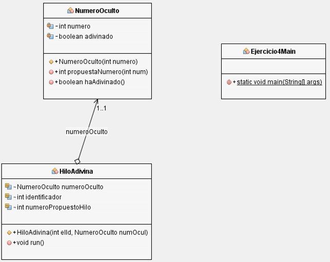

# Práctica 2.2 - Uso de monitores en Java

## Descripción de la tarea

Un hilo debe generar un número al azar entre 0 y 100, que deben intentar adivinar otros diez hilos. Si un hilo acierta el número, debe terminar su ejecución inmediatamente. Y el resto de los hilos deben también terminar su ejecución en cuanto propongan un número y se les avise de que otro hilo ya ha acertado el número.

Se propone utilizar una clase NumeroOculto con un método *int propuestaNumero(int num)* que devuelva los siguientes valores:

- – 1 si el juego ya ha terminado porque un hilo ha adivinado el número.
- 1 si el número propuesto (num) es el número oculto.
- 0 en otro caso.

No hace falta crear una clase para el hilo que genera el número al azar. Es el hilo inicial, que ejecuta el método main, y que crea el resto de los hilos.

{ width="700" }

## Criterios de evaluación

Esta práctica evalúa todos los criterios de evaluación del **RA2**. Para su corrección se tendrá en cuenta:

1. Funcionalidad del ejercicio (5 puntos)
	- Implementa adecuadamente todos los requisitos de la aplicación.
2. Uso correcto de la sincronización de los hilos (3 puntos)
	- Implementa adecuadamente la sincronización de los hilos usando monitores.
3. Calidad del código y buenas prácticas (0,5 puntos)
    - Código legible y bien estructurado, con indentación adecuada y nombres de variables descriptivos.
	- Uso de comentarios y documentación donde sea necesario.
4. Manejo de errores (0,5 puntos)
	- Mensajes de error claros y útiles.
5. Ejecución y salida correcta (1 punto)
	- Las aplicaciones se ejecutan sin errores y producen la salida esperada.

## Método de entrega

Comprime el proyecto en un archivo ZIP y súbelo a la plataforma Moodle Centros en el lugar dedicado a ello. El archivo ZIP deberá tener el siguiente formato:

**Apellido1Apellido2_Nombre_PSP_UD2_P2.zip**