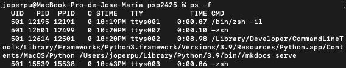
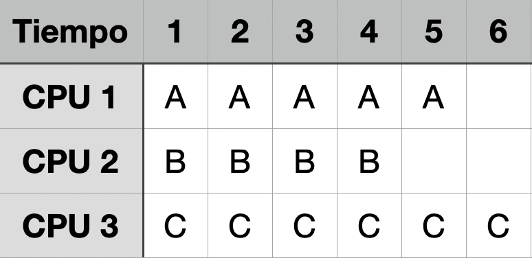
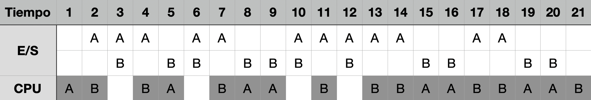
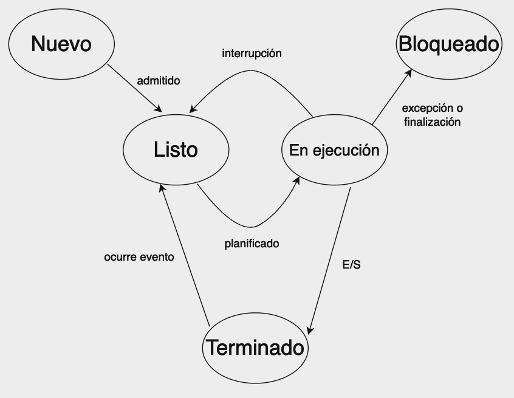
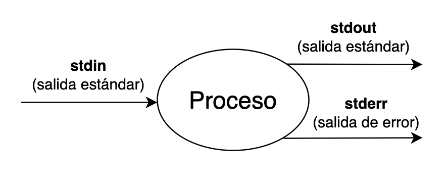

# Unidad 1 - Programación multiproceso

## IDE

En el módulo de Programación de servicios y procesos usaremos como entorno de desarrollo **IntelliJ IDEA**. Es un IDE desarrollado por JetBrains, diseñado principalmente para el desarrollo en Java. Es conocido por sus potentes herramientas de asistencia al desarrollador, incluyendo análisis de código, refactorización inteligente, autocompletado de código y navegación avanzada.

Podemos [descargarlo en su página web](https://www.jetbrains.com/idea/), y gracias a la cuenta corporativa de _@g.educaand.es_ tenemos licencia educativa por un año renovable.

## Ejercicios de repaso de programación en Java

#### Calculadora básica

Crea una aplicación de consola que actúe como una calculadora básica. El usuario puede seleccionar la operación a realizar (suma, resta, multiplicación y división) e ingresar dos números. El programa debe mostrar el resultado de la operación. Como complicación, la multiplicación y la división no pueden realizarse con su operador aritmético propio.

#### Gestión de estudiantes

Diseña una aplicación que permita gestionar una lista de estudiares. Cada estudiante tiene nombre, edad y calificaciones en varias asignaturas. El programa debe permitir agregar, eliminar y listar estudiantes, así como calcular el promedio de calificaciones. De cada asignatura guardamos su nombre y calificación. Utiliza clases y colecciones para resolver este ejercicio.

#### Juego del ahorcado

Implementa el clásico juego del ahorcado. El programa selecciona una palabra al azar de una lista predefinida y el usuario intenta adivinarla letra por letra.

#### Verificador de palíndromos

Desarrolla una aplicación de consola que permita al usuario ingresar una palabra o frase y determine si es un palíndromo. Un palíndromo es una palabra o frase que se lee igual de izquierda a derecha que de derecha a izquierda, ignorando espacios, signos de puntuación y diferencias entre mayúsculas y minúsculas.

## Programas, procesos y servicios

### Programa

Un programa contiene un conjunto de instrucciones que se pueden ejecutar directamente en una máquina. Se trata de un objeto estático, normalmente almacenado en un fichero binario en un medio de almacenamiento secundario.

### Proceso

Por su parte, un proceso corresponde a una instancia de un programa en ejecución. Se trata de una entidad dinámica. La ejecución de un programa comienza con la creación y ejecución de un proceso y utiliza los siguientes recursos del sistema:

* Memoria.
* Procesador o CPU.
* Dispositivos de E/S.

Igualmente, cada proceso lleva asociado:

* Registros.
* Contador de programa.
* Bloque de control de proceso.

* En Linux podemos usar el comando __ps__ para obtener información sobre los procesos.
    * Para mostrar más información podemos usar __ps -f__ o __ps -Af__.

<center></center>

* En Windows podemos usar el comando __tasklist__ o el __administrador de tareas__.

<center>{ width="500" }</center>

El número de procesos que pueden convivir simultáneamente en un sistema es alto, por lo que supera ampliamente el número de núcleos de la CPU. El sistema operativo es el encargado de gestionar que los recursos a los que acceden cada procesos se repartan de forma ordenada, justa y eficiente.

### Servicio

Los servicios son un tipo particular de procesos que proporcionan determinados servicios (de ahí su nombre) a otros procesos. Se ejecutan en segundo plano (en _background_) y no son directamente usados por los usuarios. Además se ejecutan continuamente y normalmente son iniciados por el propio sistema operativo en el arranque de este. Los servicios pueden proporcionar servicios a otros procesos en el mismo ordenador y también a otros procesos en otros ordenadores.

Todos los sistemas operativos modernos diferencian claramente entre procesos y servicios. En la presente unidad trataremos los primeros. Igualmente, cada sistema operativo tiene su propia aplicación de gestión de procesos.


## Planificación de procesos

Todos los sistemas actuales, salvo aquellos más sencillos (como algunos microcontroladores), son capaces de realizar multitarea o multiproceso.

El planificador de procesos es el elemento del sistema operativo que se encarga de repartir los recursos del sistema entre los procesos que lo demandan. Los objetivos del planificador son los siguientes:

* Maximizar el rendimiento del sistema.
* Maximizar la equidad en el reparto de los recursos.
* Minimizar los tiempos de espera.
* Minimizar los tiempos de respuesta.

Existen varios niveles de planificación:

* Planificador a largo plazo o de trabajos: decide qué procesos son admitidos para su ejecución.
* Planificador a corto plazo o de procesador: reparte el tiempo de procesador entre todos los procesos.
* Planificador a medio plazo: gestiona el paso de procesos de la memoria principal a la secundaria (suspensión) y viceversa (reanudación).

Según el número de procesadores de un sistema podemos clasificarlos como:

* Sistemas monoprocesadores: la ejecución concurrente de varios procesos en un sistema monoprocesador se conoce con el nombre de multiprogramación.
* Sistemas multiprocesadores: disponen de más de un procesador. A su vez, pueden ser de dos tipos:
    * Sistema fuertemente acoplado: la memoria y los dispositivos de entrada/salida son compartidos entre todos los procesadores.
    * Sistema débilmente acoplado: cada procesador posee su propia memoria y dispositivos de entrada/salida.

## Multitarea

La multitarea (o _multitasking_) consiste en la ejecución simultánea de más de un proceso en un procesador a lo largo del tiempo. Para que los procesos no tengan que esperar a que finalicen todos los demás, los sistemas aprovechan los recursos al máximo para crear la ilusión de que varios procesos se ejecutan de forma simultánea.

<center>{ width="500"}</center>

### Ejecución de procesos en un sistema multiprocesador

<center>{ width="300" }</center>

### Ejecución de procesos con multitarea, con operaciones de E/S

<center>{ width="600" }</center>

## Hilos y procesos

Los hilos o hebras (_threads_ en inglés) son las unidades más pequeñas de procesamiento que pueden ejecutar tareas de manera concurrente dentro de un proceso. Un proceso en ejecución tiene inicialmente un hilo, pero se pueden crear más de manera sencilla y rápida. La ejecución de un proceso finaliza cuando termina la ejecución de todos sus hilos.

| Procesos | Hilos |
| -------------- | -------------- |
| Constan de uno o más hilos | Un hilo siempre existe dentro de un proceso |
| Son independientes unos de otros | Comparten los recursos del proceso de forma directa |
| Son gestionados por el SO | Son gestionados por el proceso |
| Se comunican a través del SO | La comunicación controla el proceso |

## Programación concurrente

Se denominan __procesos concurrentes__ a los que se ejecutan simultáneamente durante un intervalo de tiempo, ya sea de forma real (en sistemas multiprocesadores) o simulada (en sistemas monoprocesadores o en un mismo procesador de un sistema multiprocesador).

Por su parte, hablamos de __programación concurrente__ cuando se ejecutan varios procesos concurrentes en un sistema, y también para hacer referencia a las técnicas que permiten desarrollar programas que utilizan varios procesos concurrentes que funcionan de forma conjunta y coordinada, para realizar una tarea.

### Ventajas

* Permite incrementar el rendimiento del sistema, porque los procesadores pasan a ejecutar otros procesos cuando el proceso que ejecutan está descopuado o a la espera de que termine una operación de E/S.
* Hace posible un menor tiempo de respuesta, ya que el tiempo de procesador se distribuye entre todos los procesos en ejecución.

### Inconvenientes

* Dificulta la implementación de mecanismos adecuados de sincronización y comunicación entre procesos.
* Es posible que la sobrecarga que suponen anule la mejora en el rendmiento que propociona la concurrencia.
* En sistemas distribuidos, la red podría convertirse en un cuello de botella si no tiene la suficiente capacidad para el tráfico que genera el intercambio de mensajes entre procesos.

## Programación paralela y distribuida

La __programación paralela__ consiste en la ejecución de varios procesos concurrentes en un sistema multiprocesador. Estos procesos se pueden ejecutar con paralelismo real.

La __programación distribuida__ consiste en la ejecución de varios procesos concurrentes en un sistema distribuido. Se usa también este término para hacer referencia al desarrollo de programas que utilizan varios procesos concurrentes que pueden ejecutarse en distintos procesadores de un sistema distribuido, y a las técnicas que lo hacen posible.

En un __sistema distribuido__ no hay memoria compartida ni red de conexión expecífica entre los distintos ordenadores. La comunicación entre procesos se realiza mediante mensajes a través de la red de comunicaciones que conecta los distintos ordenadores, para lo que se suele utlizar los protocolos de red UDP o TCP.

## Estados de un proceso

Como hemos comentado al principio, los procesos son programas en ejecición, que requieren recursos como el tiempo de la CPU, memoria y acceso a dispositivos de entrada/salida. 

Cada proceso puede estar en uno o varios __estados__ durante su ciclo de vida. Estos estados definen qué está haciendo el proceso en un momento dado y permiten al sistema operativo gestionar múltiples procesos de manera eficiente.

Los estados básicos en los que puede estar un proceso son los siguientes:

* __Nuevo__ (_new_): Un proceso recién creado se encuentra en este estado. Se han asignado los recursos iniciales, pero aún no ha comenzado a ejecutarse. El proceso está esperando ser admitido en la cola de procesos listos.
* __Listo__ (_ready_): El proceso ha sido cargado en la memoria principal y está preparado para ser ejecutado. Se en cuentra en una cola de procesos listos a la espera de que el planificador del sistema operativo (__scheduler__) le asigne tiempo de CPU. En este estado, el proceso no está ejecutándose, pero podría hacerlo tan pronto como el sistema operativo se lo permita.
* __En ejecución__ (_running_): En este estado, el proceso está siendo ejecutado en la CPU. Solo un proceso puede estar en este estado por núcleo de CPU por unidad de tiempo, aunque en sistemas con múltiples núcleos es posible que varios procesos estén en ejecución simultáneamente en diferentes núcleos.
* __Bloqueado__ (_blocked_) o __Espera__ (_waiting_): El proceso se encuentra en este estado cuando está esperando que ocurra un evento específico, como la finalización de una operación de entrada/salida o la disponibilidad de un recurso. Mientras el proceso está bloqueado, no puede continuar con su ejecución y debe esperar a que el evento suceda. Una vez que se cumple la condición de espera, el proceso pasa al estado de __Listo__.
* __Terminado__ (_terminated_) o __Finalizado__ (_exit_): Cuando un proceso ha completado su ejecución o ha sido terminado por el sistema (ya sea de forma normal o por algún error), entra en este estado. Todos los recursos asociados con el proceso son liberados por el sistema operativo, y su estado final queda registrado para propósitos de control y depuración.

<center>{ width="600"}</center>

## Comunicación entre procesos

Los procesos poseen dos maneras de comunicarse con otros procesos:

* **Intercambio de mensajes**: Es la forma habitual cuando los procesos se encuentran en máquinas distintas. El intercambio de información se realiza a través de un protocolo establecido preciamente.
* **Recursos (memoria) compartidos**: Solo se puede usar cuando los dos procesos se encuentran en la misma máquina y permite la sincronización de los procesos en función del valor o estado de un recurso compartido.

La comunicación entre procesos se denomina **IPC** (_Inter-Process Communication_) y existen diversas alternativas para llevarla a cabo:

* Utilización de sockets.
* Utilización de flujos de entrada y salida.
* RPC (_Remote Process Call_). Llamada a procedimiento remoto.
* Mediente el uso de sistemas de persistencia.
* Mediante el uso de servicios proporcionados a través de Internet.

## Sincronización entre procesos

El planificador del sistema operativo es el encargado de decidir en qué momento tiene acceso a los recursos un proceso, pero a nivel general, la decisión de crear y lanzar un proceso es humana, y es expresada a través de un algoritmo.

Para gestionar el flujo de trabajo entre procesos se necesita disponer de los siguientes mecanismos:

* **Ejecución**: Un mecanismo para ejecutar procesos desde un proceso.
* **Espera**: Un mecanismo para bloquear la ejecución de un proceso a la espera de que otro proceso termine.
* **Generación de código de terminación**: Un mecanismo de comunicación que permita indicar a un proceso cómo ha terminado la ejecución mediante un código.
* **Obtención de código de terminación**: Un mecanismo que permita a un proceso obtener el código de terminación de otro proceso.

## Programación de aplicaciones multiproceso en Java

En Java, la creación de un proceso puede realizarse de dos maneras diferentes:

* Utilizando la clase **java.lang.Runtime**.
* Utilizando la clase **java.lang.ProcessBuilder**.

La clase **java.lang.Runtime** se usa principalmente para interactuar con el JRE de Java. Esta clase proporciona métodos para lanzar procesos, llamar al recolector de basura, saber la cantidad de memoria disponible y libre, etc.

Toda aplicación Java tiene una única instancia de la clase Runtime, que permite que la propia aplicación interactúe con su entorno de ejecición a través del método estático **getRuntime()**.

Este método proporciona un canal de comunicación entre la aplicación y su entorno, posibilidanto la interacción del sistema operativo a través del método **exec**.

[https://docs.oracle.com/en/java/javase/21/docs/api/java.base/java/lang/Runtime.html](https://docs.oracle.com/en/java/javase/21/docs/api/java.base/java/lang/Runtime.html)

En el paque **java.lang** tenemos dos clases para la gestión de procesos:

* **java.lang.ProcessBuilder**:
    * [https://docs.oracle.com/en%2Fjava%2Fjavase%2F21%2Fdocs%2Fapi%2F%2F/java.base/java/lang/ProcessBuilder.html](https://docs.oracle.com/en%2Fjava%2Fjavase%2F21%2Fdocs%2Fapi%2F%2F/java.base/java/lang/ProcessBuilder.html)
* **java.lang.Process**
    * [https://docs.oracle.com/en/java/javase/21/docs/api/java.base/java/lang/Process.html](https://docs.oracle.com/en/java/javase/21/docs/api/java.base/java/lang/Process.html)

Las instancias de **ProcessBuilder** gestionan los atributos de los procesos, mientras que las instancias de **Process** controla la ejecución de esos mismos procesos cuando se ejecutan.

La clase **Process** es **abstracta** y, por lo tanto, no se pueden crear objetos de ella, sino de subclases suyas, que. de hecho, implementan procesos nativos, es decir, procesos de plataformas específicas que se ejecutan en un sistema operativo particular para un tipo de procesador particular.

La clase **Process** tiene métodos para lanzar un proceso, obtener información acerca de su estado y controlar su ejecución.

### Métodos de la clase **java.lang.Process**

| Métodos | Descripción |
| ------- | ----------- |
| **destroy()** | Destruye el proceso sobre el que se ejecuta |
| **exitValue()** | Devuelve el valor de retorno del proceso cuando este finaliza. Sirve para controlar el estado de la ejecución |
| **getErrorStream()** | Proporciona un InputStream conectado a la salida de error del proceso. |
| **getInputStream()** | Proporciona un InputStream conectado a la salida normal del proceso. |
| **getOutputStream()** | Proporciona un OutputStream conectado a la entrada normal del proceso. |
| **isAlive()** | Determina si el proceso está o no en ejecución. |
| **waitFor()** | Detiene la ejecución del programa que lanza el proceso a la espera de que este último termine. |

Con **ProcessBuilder** se puede configurar previamente el entorno de ejecución de los procesos que crea y, en particular, redigirir su entrada y salida.

El constructor de **ProcessBuilder** admite parámetros que serán entregados al proceso que se crea:

    ProcessBuilder(List<String>command)
    ProcessBuilder(String... command)

La ejecución del proceso se realiza a partir de la invocación al método _start()_:

```java
// Ejemplo en Windows
ProcessBuilder pb = new ProcessBuilder("cmd", "/C", "dir");
// Ejemplo en Linux
ProcessBuilder pb = new ProcessBuilder("/bin/bash", "-c", "ls");
// Ejemplo en MacOS
ProcessBuilder pb = new ProcessBuilder("sh", "-c", "ls");

Process p = pb.start();
```
### Métodos de la clase **java.lang.ProcessBuilder**

| Métodos | Descripción |
| ------- | ----------- |
| **start()** | Inicia un nuevo proceso usando los atributos especificados. |
| **command()** | Permite obtener o asignar el programa y los argumentos de la instancia de ProcessBuilder. |
| **directory()** | Permite obtener o asignar el directorio de trabajo del proceso. |
| **environment()** | Proporciona información sobre el entorno de ejecución del proceso. |
| **redirectError()** | Permite determinar el destino de la salida de errores. |
| **redirectInput()** | Permite determinar el origen de la entrada estándar. |
| **redirectOutput()** | Permite determinar el destino de la salida estándar. |

## Gestión de la E/S de un proceso

Un subproceso no tiene terminal o consola en el que poder mostrar su información. Los procesos lanzados con el método _start()_ redireccionan los streams de E/S estándar (stdin, stdout, stderr) al proceso padre. Si se necesita se puede acceder a ellos a través de los streams obtenidos con los métodos definidos en la clase Process como _getInputStream()_, _getOutputStream()_ y _getErrorStream()_. Esta es la forma de enviar y recibir información desde los subprocesos.

<center>{ width="500" }</center>

### getInputStream()

Este método se utiliza para leer el stream de salida del proceso, es decir, para leer lo que el comando ejecutado (proceso hijo) ha enviado a la consola.

```java
Process p = pbuilder.start();
BufferedReader processOutput = new BufferedReader(
    new InputStreamReader(p.getInputStream()));

String linea;
while((linea = processOutput.readLine()) != null)
{
    System.out.println("> " + linea);
}

processOutput.close();
```
Este código ejecuta un proceso externo y lee su salida estándar línea a línea, mostrándola en la termina.

Primero iniciamos un nuevo proceso usando _pbuilder.start()_. El médoto _start()_ ejecuta el proceso configurado en _pbuilder_ y devuelve un objeto _Process_ que representa el proceso en ejecución.

A continuación creamos un _InputStreamReader_ que toma el flujo de entrada del proceso _(p.getInputStream())_, que en realidad corresponde a la **salida estándar (stdout)** del proceso. Este _InputStreamReader_ se envuelve de un _BufferedReader_ para facilitar la lectura eficiente de texto, especialmente línea a línea.

Finalmente, el bucle while utiliza _processOutput.readLine()_ para leer cada línea de la salida del proceso. Este método devuelve _null_ cuando no hay más líneas por leer. Dentro del bucle cada línea leída se imprime en consola, precedida por "> ". Por último, despues de leer todas las líneas se cierra el _BufferedReader_ para linerar los recursos asociados.

### getErrorStream()

Podemos obtener la salida de error (stderr) que genera el proceso hijo para procesarla desde el padre.

* Si la salida de error ha sido previamente redirigida usando el método _ProcessBuilder.redirectErrorStream(true)_ la salida de error y la salida estándar llegarán juntas con _getInputStream()_ y no es necesario hacer un tratamiento adicional.
* Si por el contrario queremos hacer un tratamiento diferenciado de los dos tipos de salida, podemos usar un esquema similar al usado anteriormente, con la salvedad de que ahora en lugar de llamar a _getInputStream()_ lo hacemos con _getErrorStream()_.

### getOutputStream()

Este método se usa para enviar información desde el proceso padre al proceso hijo. De la misma forma que con las entradas que llegan desde el proceso hijo, podemos enviar la información usando directamente el _OutputStream_ del proceso, pero lo haremos con un Decorator.

En este caso, el _wrapper_ de mayor nivel para usar un _OutputStream_ es la clase _PrintWriter_ que nos ofrece métodos similares a los de _System.out.printxxxxx_ para gestionar el flijo de comunicación con el proceso hijo.

```java
PrintWriter toProcess = new PrintWriter(
    new BufferedWriter(
        new OutputStreamWriter(
            p.getOutputStream(), "UTF-8")), true);

toProcess.println("Enviar al hijo");
```

### Ejercicio resuelto de comunicación entre procesos

Implementa una aplicación, llamada **Frecuencia**, que dado un texto recibido a través de su entrada estándar obtenga la frecuencia absoluta de cada una de las vocales, es decir, la cantidad de veces que aparece cada vocal. En el caso de que una de las vocales no aparezca la frecuencia será 0. Por ejemplo: para la palabra “estupendo” el resultado debe ser 0 2 0 1 1.

Implementa una aplicación que introduzca por teclado una cadena y ejecute el programa anterior para visualizar la salida del número de vocales de dicha cadena. La aplicación se llamará **Lanzador**.

#### Frecuencia.java

```java
import java.util.Scanner;

public class Frecuencia {
    public static void main(String[] args) {
        Scanner scanner = new Scanner(System.in);
        String input = scanner.nextLine();
        scanner.close();

        int countA = 0;
        int countE = 0;
        int countI = 0;
        int countO = 0;
        int countU = 0;

        input = input.toLowerCase();

        for (char c : input.toCharArray()) {
            switch (c) {
                case 'a':
                    countA++;
                    break;
                case 'e':
                    countE++;
                    break;
                case 'i':
                    countI++;
                    break;
                case 'o':
                    countO++;
                    break;
                case 'u':
                    countU++;
                    break;
                default:
                    // No es una vocal
            }
        }

        System.out.println(countA + " " + countE + " " + countI + " " + countO + " " + countU);
    }
}
```

#### Lanzador.java

```java
import java.io.*;

public class Lanzador {
    public static void main(String[] args) {
        try {
            // Leer cadena desde el teclado
            BufferedReader reader = new BufferedReader(new InputStreamReader(System.in));
            System.out.print("Introduce una cadena: ");
            String inputString = reader.readLine();

            // Obtener el classpath actual
            String classpath = System.getProperty("java.class.path");

            // Crear el proceso para ejecutar Frecuencia
            ProcessBuilder pb = new ProcessBuilder ("java", "-cp", classpath, "Frecuencia");
            Process process = pb.start();

            // Enviar la cadena al proceso Frecuencia
            BufferedWriter writer = new BufferedWriter(new OutputStreamWriter(process.getOutputStream()));
            writer.write(inputString);
            writer.newLine(); // Importante para indicar el fin de la entrada
            writer.flush();
            writer.close();

            // Leer la salida del proceso Frecuencia
            BufferedReader processOutputReader = new BufferedReader(new InputStreamReader(process.getInputStream()));
            String line = processOutputReader.readLine();
            System.out.println("Frecuencia de vocales: " + line);


            process.waitFor(); // Esperar a que el proceso termine
            processOutputReader.close();

        } catch (IOException | InterruptedException e) {
            e.printStackTrace();
        }
    }
}
```

## Redirección de la E/S

En un sistema real probablemente necesitemos guardar los resultados de un proceso en un archivo de log o de errores para su posterior análisis.

Para redigirir la E/S lo haremos mientras preparamos el proceso para ser ejecutado, de forma que cuando se lancen sus stream de E/S salida se modifiquen. Por eso, en esta ocasión, los métodos que nos permiten redireccionar la E/S de los procesos son méetodos de la clase **ProcessBuilder**.

Los métodos a utilizar serían _redirectOutput(File)_, _redirectInput(File)_ y _redirectError(File)_. Para hacer las redirecciones también podemos utilizar la clase _ProcessBuilder.Redirect_ como parámetro para los métodos anteriores, utilizando uno de los siguientes valores.

| Valor | Significado |
| ----- | ----------- |
| **Redirect.DISCARD** | La información se descarta. |
| **Redirect.to(File)** | La información se guardará en el fichero indicado. Si existe, se vacía. |
| **Redirect.from(File)** | La información se leerá del fichero indicado. |
| **Redirect.appendTo(File)** | La información se añadirá en el fichero indicado. Si existe, no se vacía. |

### Ejercicio resuelto de redirección de la salida de un proceso a un fichero de texto

Crea una aplicación Java que cree dos procesos. El primero de ellos deberá listar el contenido del directorio en el que se encuentra, mientras que el segundo deberá mostrar la información del sistema. Almacena en dos ficheros distintos la salida de cada uno de los procesos. Finalmente sincronizalos.

#### MultiProcessApp.java
```java
import java.io.*;

public class MultiProcessApp {

    public static void main(String[] args) {
        try {
            // Crear el primer proceso que lista el contenido del directorio actual (equivalente a 'dir' en Windows)
            ProcessBuilder processBuilder1 = new ProcessBuilder("sh", "-c", "ls");
            processBuilder1.redirectOutput(new File("output_ls.txt"));  // Redirigir la salida a un archivo
            Process process1 = processBuilder1.start();

            // Crear el segundo proceso que muestra la información del sistema (equivalente a 'systeminfo' en Windows)
            ProcessBuilder processBuilder2 = new ProcessBuilder("sh", "-c", "uname -a");
            processBuilder2.redirectOutput(new File("output_uname.txt"));  // Redirigir la salida a un archivo
            Process process2 = processBuilder2.start();

            // Sincronizar ambos procesos
            int exitCode1 = process1.waitFor();
            int exitCode2 = process2.waitFor();

            System.out.println("Proceso 1 terminado con código: " + exitCode1);
            System.out.println("Proceso 2 terminado con código: " + exitCode2);

        } catch (IOException | InterruptedException e) {
            e.printStackTrace();
        }
    }
}
```