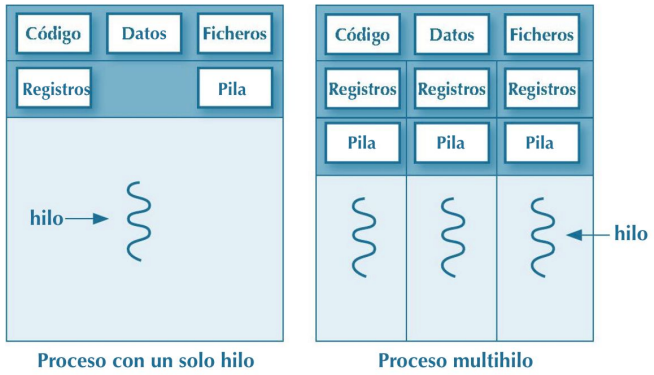
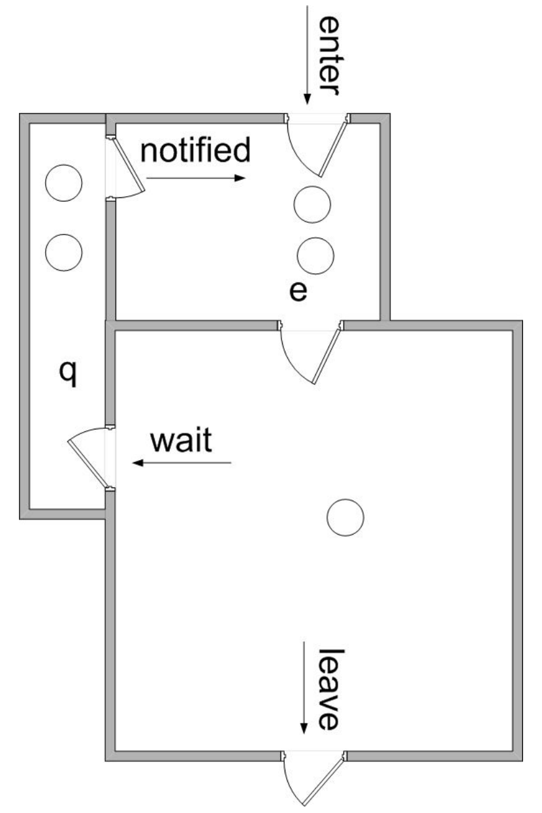

# Unidad 2 - Programación multihilo

## El concepto de hilo en programación

En programación, un hilo (o *thread* en inglés) es la unidad más pequeña de procesamiento que puede ser gestionada de manera independiente por un sistema operativo. Los hilos permiten que un programa realice múltiples tareas de forma concurrente dentro del mismo proceso.

### Características principales de los hilos

- **Compartición de recursos**:
	- Todos los hilos de un mismo proceso comparten el mismo espacio de direcciones de memoria, lo que facilita la comunicación y el intercambio de datos entre ellos.
	- Comparten recursos como archivos abiertos, variables globales y otros recursos del proceso padre.
- **Ejecución concurrente**:
    - Los hilos permiten que diferentes partes de un programa se ejecuten al mismo tiempo, aprovechando mejor los recursos del sistema, especialmente en sistemas con múltiples núcleos de procesamiento.
	- Esto puede mejorar el rendimiento y la capacidad de respuesta de las aplicaciones, especialmente en operaciones que son independientes entre sí.
- **Ligereza**:
	- Los hilos son más ligeros en términos de recursos que los procesos completos, ya que comparten el mismo espacio de memoria y otros recursos.
	- Crear y gestionar hilos suele ser más rápido y consume menos memoria que manejar múltiples procesos.
- **Sincronización**:
	- Dado que los hilos comparten el mismo espacio de memoria, es fundamental gestionar adecuadamente el acceso a los recursos compartidos para evitar condiciones de carrera, bloqueos y otros problemas de concurrencia.
	- Se utilizan mecanismos como mutexes, semáforos y monitores para sincronizar el acceso a recursos compartidos.

### Ejemplos de uso de hilos

- **Interfaces de usuario**: Mantener la interfaz receptiva mientras se realizan operaciones de fondo, como descargas o cálculos intensivos.
- **Servidores web**: Manejar múltiples solicitudes de clientes simultáneamente, asignando un hilo a cada conexión.
- **Aplicaciones de tiempo real**: Procesar datos en tiempo real, como en aplicaciones de audio o video, donde es crucial manejar múltiples flujos de datos de manera simultánea.

### Diferencia entre procesos e hilos

- **Proceso**: Es una instancia de un programa en ejecución, con su propio espacio de direcciones de memoria y recursos independientes.
- **Hilo**: Es una unidad de ejecución dentro de un proceso que comparte el mismo espacio de memoria y recursos con otros hilos del mismo proceso.

### Ventajas de usar hilos

- **Mejor utilización de recursos**: Aprovechan mejor los sistemas con múltiples núcleos de procesamiento.
- **Mejor rendimiento**: Pueden reducir el tiempo de ejecución total al realizar tareas en paralelo.
- **Mayor responsividad**: Permiten que las aplicaciones mantengan una interfaz de usuario fluida mientras realizan tareas de fondo.

### Desafíos al usar hilos

- **Complejidad de programación**: La programación concurrente puede ser más complicada y propensa a errores.
- **Problemas de sincronización**: Necesidad de gestionar adecuadamente el acceso a recursos compartidos para evitar conflictos.
- **Depuración difícil**: Los errores relacionados con la concurrencia pueden ser difíciles de reproducir y solucionar.

## El problema de la sección crítica

El problema de la sección crítica es un concepto fundamental en la programación concurrente y multihilo. Se refiere a la dificultad de gestionar el acceso a recursos compartidos por múltiples hilos de ejecución de manera segura y eficiente.

### Definición del problema de la sección crítica

Una sección crítica es una parte del código de un programa donde se accede o se modifica un recurso compartido, como una variable global, una estructura de datos, un archivo o cualquier otro recurso que pueda ser utilizado por múltiples hilos simultáneamente. El problema surge cuando varios hilos intentan entrar en su sección crítica al mismo tiempo, lo que puede llevar a condiciones de carrera, inconsistencias de datos y comportamientos impredecibles.

### Relación con los hilos

En un entorno multihilo, múltiples hilos pueden ejecutarse de manera concurrente dentro del mismo proceso y, por lo tanto, pueden acceder a los mismos recursos compartidos. Sin una adecuada sincronización, si dos o más hilos acceden y modifican un recurso compartido simultáneamente, pueden producirse resultados incorrectos. Este escenario es precisamente el núcleo del problema de la sección crítica.

### Ejemplo de condición de carrera

Consideremos dos hilos que intentan incrementar una variable compartida contador:

    // Supongamos que contador está inicializado en 0
    contador = contador + 1;

Si ambos hilos leen el valor de contador al mismo tiempo (digamos, 0), ambos incrementan a 1 y lo escriben de vuelta. En lugar de que contador sea 2, permanece en 1, lo que demuestra una condición de carrera.

### Soluciones al problema de la sección crítica

Para resolver el problema de la sección crítica, es necesario garantizar que solo un hilo pueda acceder a la sección crítica en un momento dado. Existen varios mecanismos y técnicas para lograr esta exclusión mutua:

1. **Locks (bloqueos) o Mutexs (exclusión mutua)**:
	- Mutex: Es un objeto de sincronización que permite que solo un hilo acceda a la sección crítica. Un hilo adquiere el mutex antes de entrar en la sección crítica y lo libera al salir.
	- Ejemplo en pseudocódigo:

    ```pseudo
    mutex.lock()
    // Sección crítica
    contador = contador + 1
    mutex.unlock()
    ```

2. **Semáforos**:
    - Un semáforo es una variable que controla el acceso a uno o más recursos. Un semáforo binario funciona de manera similar a un mutex, mientras que uno de conteo puede permitir que múltiples hilos accedan simultáneamente hasta un límite establecido.
	- Ejemplo en pseudocódigo:

    ```pseudo
    semaphore.wait()
    // Sección crítica
    contador = contador + 1
    semaphore.signal()
    ```

3. **Monitores**:
	- Es una abstracción de alto nivel que combina mutexes y variables de condición para gestionar el acceso a recursos compartidos de manera más estructurada.
	- Muchos lenguajes de programación modernos, como Java, proporcionan soporte integrado para monitores.
4. **Variables atómicas**:
	- Operaciones atómicas permiten realizar ciertas operaciones de manera indivisible, evitando así las condiciones de carrera sin necesidad de bloqueos explícitos.
	- Ejemplo en Java:

    ```java
    import java.util.concurrent.atomic.AtomicInteger;   
    public class EjemploAtomico {
        public static void main(String[] args) {
            // Inicialización de la variable atómica con valor 0
            AtomicInteger contador = new AtomicInteger(0);
        
            // Incrementar el contador de forma atómica
            contador.getAndIncrement(); // Alternativamente, puedes usar contador.incrementAndGet()
        
            // Imprimir el valor actual del contador
            System.out.println("Valor del contador: " + contador.get());
        }
    }
    ```

5. **Secciones críticas y bloques synchronized**:
	- Algunos lenguajes proporcionan construcciones específicas para definir regiones críticas. Por ejemplo, en Java, la palabra clave *synchronized* puede usarse para sincronizar métodos o bloques de código.

Además, hay que tener en cuenta una serie de consideraciones:

- **Evitar deadlocks (bloqueos mutuos)**: Al implementar mecanismos de sincronización, es crucial diseñar el sistema de manera que no se produzcan bloqueos donde dos o más hilos esperan indefinidamente por recursos que nunca serán liberados.
- **Maximizar la concurrencia**: Aunque la exclusión mutua es necesaria para proteger recursos compartidos, un uso excesivo de bloqueos puede reducir la concurrencia y afectar el rendimiento. Es importante equilibrar la seguridad y la eficiencia.
- **Condiciones de carrera y visibilidad**: Además de la exclusión mutua, es esencial asegurar que los cambios realizados por un hilo sean visibles para otros hilos, lo cual se logra mediante la sincronización adecuada y el uso de variables volátiles o de memoria compartida correctamente gestionada.


## Programación de hilos en Java

La ejecución de un proceso comienza con un único hilo, pero se pueden crear más sobre la marcha. Los distintos hilos de un mismo proceso comparten:

- El espacio de memoria asignado al proceso.
- La información de acceso a ficheros. Estos se utilizan no solo para almacenar datos, sino también para controlar dispositivos de E/S.

En cambio, cada hilo tiene sus propios valores para:

- Los registros del procesador.
- El estado de su pila (stack). En la pila se guarda información acerca de las llamadas en curso de ejecución a métodos de diversos objetos. Para cada llamada se guardan, entre otras cosas, los datos locales (en variables internas del método).

<center></center>

## Creación de hilos en Java

### Interfaz Runnable

Cuando un programa en Java se lanza (se convierte en un proceso) empieza a ejecutarse por su método main()
que lo ejecuta el thread principal, un hilo especial creado por la JVM para ejecutar la aplicación.

Desde un proceso se pueden crear e iniciar tantos threads como necesites. Estos hilos ejecutarán partes del código de la aplicación en paralelo con el hilo principal.

Los hilos en Java son un objeto como cualquier otro. Un hilo es una instancia de la clase **java.lang.Thread**, o instancias de clases que heredan de esta. Los hilos tienen la capacidad de ejecutar código.

La forma más usada para indicar a un hilo que código queremos que ejecute es creando una clase que implemente la interfaz **java.lang.Runnable**.

[https://docs.oracle.com/en/java/javase/11/docs/api/java.base/java/lang/Runnable.html](https://docs.oracle.com/en/java/javase/11/docs/api/java.base/java/lang/Runnable.html)

#### Clase Java que implementa la interfaz Runnable

```java
public class MyRunnable implements Runnable{
    public void run(){
        System.out.println("MyRunnable running");
    }
}
```

#### Implementación con clase anónima de la interfaz Runnable

```java
Runnable myRunnable = new Runnable(){
    public void run(){
        System.out.println("Runnable running");
    }
}
```

#### Implementación de Runnable a través de una expresión Lambda

```java
Runnable runnable = ()->{System.out.println("Lambda Runnable running");};
```

### La clase Thread

La segunda forma que tenemos que indicar a un thread el código a ejecutar es creando una subclase de **java.lang.Thread** y sobrescribiendo el método run(). La clase Thread implementa de forma implícita la interfaz **Runnable**. Al igual que con Runnable, el método run() contiene el código que ejecutará un thread cuando se llame al método start().

```java
public class MyThread extends Thread{
    public void run(){
        System.out.println("MyThread running");
    }
}

MyThread myThread = new MyThread();
myThread.start();
```
[https://docs.oracle.com/en/java/javase/11/docs/api/java.base/java/lang/Thread.html](https://docs.oracle.com/en/java/javase/11/docs/api/java.base/java/lang/Thread.html)

Para hacer que un Thread ejecute el código del método run de una clase (instancia de clase, clase anónima, expresión lambda) que implemente la interfaz Runnable, tenemos que pasar esa instancia como parámetro en el constructor de la clase Thread.

```java
Runnable runnable = new MyRunnable();

Thread thread = new Thread(runnable);
thread.start();
```

Cuando se inicia el thread, llamando a su método start(), se crea un nuevo thread que ejecuta el código del método run de la instancia MyRunnable.

#### Ejemplo de uso de Runnable y Thread

```java
/**
 * ESTA CLASE IMPRIME POR CONSOLA UN NÚMERO PRIMO MAYOR QUE EL NÚMERO
 * QUE SE LE HA PROPORCIONADO A TRAVÉS DEL CONSTRUCTOR
 */
package runnable;

public class PrimoRunnable implements Runnable {

	private long minimo;
	
	public PrimoRunnable(long minimo) {
		this.minimo = minimo;
	}
	
	@Override
	public void run() {
		long n = minimo;
		while(!testPrimalidad(n)) {
			System.out.printf("%d no es primo %n", n);
			++n;
		}
		
		System.out.printf("El número primo es %d %n", n);
	}
	
	/*
	 * Método que nos permite verificar si un número es
	 * primo revisando si tiene divisores hasta n/2
	 * OJO es fácil de implementar, pero ineficiente para 
	 * números grandes
	 */
	public static boolean testPrimalidad(long n) {
		
		boolean continuar = true;
		boolean esPrimo = true;
		long divisor = 2;
		do {
			if (n % divisor == 0) {
				continuar = false;
				esPrimo = false;
			} else
				++divisor;			
				
		} while (continuar && divisor <= (n/2));
		
		return esPrimo;
	}

}
```

```java
package runnable;

public class EjemploRunnable {

	/**
	 * @param args
	 */
	public static void main(String[] args) {
		
		//Creación y lanzamiento de PrimoRunnable
		//a través de un thread.
		Thread t = new Thread(new PrimoRunnable(25));
		t.start();

		
		//Otra forma de hacerlo, a través de una 
		//instancia anónima
		new Thread(new PrimoRunnable(32)).start();

	}

}
```

#### Ejemplo de implementación de Runnable de forma anónima

```java
package runnable;

public class EjemploRunnableAnonimo {

	/**
	 * @param args
	 */
	public static void main(String[] args) {
		
		//Este trozo de código puede ser muy común si
		//el proceso de lanzamiento del hilo está dentro
		//de un manejador de eventos, como el click de un
		//botón.
		new Thread(new Runnable() {

			@Override
			public void run() {
				System.out.println("Hello from Runnable+Thread!!");
				
			}
			
		}).start();
		
		//Este código es como el anterior, pero aprovecha la potencia
		//de las expresiones lambda.
		new Thread(() -> System.out.print("Hello from Lambda Runnable+Thread")).start();

	}

}
```

#### Estados de un hilo

Durante el ciclo de vida de los hilos estos pasan por distintos estados. En Java están recogidos dentro de la enumeración State, contenida dentro de la clase **java.lang.Thread**.

El estado de un hilo se obtiene mediante el método getState() de la clase Thread.

| Estado | Valor en Thread.State | Descripción |
| -------| -------- | ------- |
| Nuevo | NEW | El hilo está creado, pero aún no se ha arrancado |
| Ejecutable | RUNNABLE | El hilo está arrancado y podría estar en ejecución o pendiente de ejecución |
| Bloqueado | BLOCKED | Bloqueado por un monitor |
| Esperando | WAITING | El hilo está esperando a que otro hilo realice una acción determinada |
| Esperando un tiempo | TIME_WAITING | El hilo está esperando a que otro hilo realice una acción determinada en un periodo de tiempo concreto |
| Finalizado | TERMINATED | El hilo ha terminado su ejecución |

#### Pausar hilos

Un thread puede pausar su propia ejecución llamando al método estático Thread.sleep(). El método sleep() recibe como parámetro el número de milisegundos que quiere estar pausado antes de volver a ponerse como listo para ejecución.

```java
try{
    Thread.sleep(3000L);
}catch(InterruptedException e){
    e.printStackTrace();
}
```

En Java podemos generar números aleatorios en el rango de los enteros, long, float y double.

- Usando la clase **Random**.
- Usando la clase **Math.random**.
- Usando **ThreadLocalRandom**.

#### Ejemplo de lanzamiento de hilos

```java
package runnable;

class Hilo implements Runnable {

  private final String nombre;

  Hilo(String nombre) {
    this.nombre = nombre;
  }

  @Override
  public void run() {
    System.out.printf("Hola, soy el hilo: %s.\n", this.nombre);
    System.out.printf("Hilo %s terminado.\n", this.nombre);
  }

}

public class LanzaHilos {

  public static void main(String[] args) throws InterruptedException {

    Thread h1 = new Thread(new Hilo("H1"));
    Thread h2 = new Thread(new Hilo("H2"));
    h1.start();
    h2.start();
    h1.join();
    h2.join();
    System.out.println("Hilo principal terminado.");

  }

}
```

#### Ejemplo de uso de sleep()

```java
package lanzahilosyesperaqueterminen;

import java.util.Random;

/* 
El siguiente programa lanza dos hilos. Cada uno de ellos hace pausas de duración aleatoria 
de ente 10 y 500 ms, utilizando el método sleep de la clase Thread. El hilo principal utiliza 
el método join para esperar a que terminen los dos hilos lanzados, por lo que siempre terminará 
el último. Los dos métodos anteriores pausan la ejecución del hilo, y durante ese periodo de tiempo 
se podría interrumpir. Si esto sucede, se lanzaría una InterruptedException, que se captura para 
mostrar un mensaje
*/


class Hilo implements Runnable {

  private final String nombre;

  Hilo(String nombre) {
    this.nombre = nombre;
  }

  @Override
  public void run() {
    System.out.printf("Hola, soy el hilo: %s.\n", this.nombre);
    for (int i = 0; i < 5; i++) {
      Random r = new Random();
      int pausa = 10 + r.nextInt(500 - 10);
      System.out.printf("Hilo: %s hace pausa de %d ms.\n", this.nombre, pausa);
      try {
        Thread.sleep(pausa);
      } catch (InterruptedException e) {
        System.out.printf("Hilo %s interrumpido.\n", this.nombre);
      }
    }
    System.out.printf("Hilo %s terminado.\n", this.nombre);
  }

}

public class LanzaHilosYEsperaQueTerminen {

  public static void main(String[] args) {

    Thread h1 = new Thread(new Hilo("H1"));
    Thread h2 = new Thread(new Hilo("H2"));
    h1.start();
    h2.start();
    try {
      h1.join();
      h2.join();
    } catch (InterruptedException ex) {
      System.out.println("Hilo principal interrumpido.");
    }
    System.out.println("Hilo principal terminado.");
  }
}
```

#### Gestión de la prioridad de los hilos

Los hilos heredan la prioridad del padre en Java, pero este valor puede ser cambiado con el método setPriority(). Con getPriority() podemos saber la prioridad de un hilo.

El valor de la prioridad varía entre 1 y 10. Cuanto más alto es el valor, mayor es la prioridad. La clase Thread define las siguientes constantes MIN_PRIORITY (valor 1), MAX_PRIORITY (valor 19) y NORM_PRIORITY (valor 5).

El planificador elige el hilo en función de su prioridad. Si dos hilos tienen la misma prioridad realiza un *round robin*, es decir, va alternando los hilos de forma cíclica.

El hilo de mayor prioridad seguirá funcionando hasta que ceda el control:

- Cede el control llamando al método yield().
- Deja de ser ejecutable (por muerte o por bloqueo).
- Aparece un hilo de mayor prioridad, por ejemplo, si se encontraba en estado dormido por una operación de E/S o bien es desbloqueado por otro con los métodos notifyAll()/notify().

##### Ejemplo de asignación de prioridad a hilos

```java

package thread;

class HiloPrioridad extends Thread {
    private int c = 0;
    private boolean stopHilo = false;
    public long getContador () {
        return c;
    }
    public void pararHilo() {
        stopHilo = true;
    }
    @Override
    public void run() {
        while (!stopHilo) c++;
    }
}

public class EjemploHiloPrioridad {
    public static void main(String args[]) {
        HiloPrioridad h1 = new HiloPrioridad();
        HiloPrioridad h2 = new HiloPrioridad();
        HiloPrioridad h3 = new HiloPrioridad();

        h1.setPriority(Thread.NORM_PRIORITY);
        h2.setPriority(Thread.MAX_PRIORITY);
        h3.setPriority(Thread.MIN_PRIORITY);

        h1.start();
        h2.start();
        h3.start();

        try {
            Thread.sleep(1);
        } catch (InterruptedException e) {}

        h1.pararHilo();
        h2.pararHilo();
        h3.pararHilo();

        System.out.println("h2 (Prio. Máx:    "+h2.getContador()+")");
        System.out.println("h1 (Prio. Normal: "+h1.getContador()+")");
        System.out.println("h3 (Prio. Mínima: "+h3.getContador()+")");
    }
}
```

##### Ejemplo de creación de grupos de hilos y asignación de prioridades

```java
package thread;

public class ThreadMethodsExample extends Thread {
    
    ThreadMethodsExample (ThreadGroup group, String name) {
        super(group, name);
    }
    
    @Override
    public void run() {
        String threadName = Thread.currentThread().getName();
        System.out.println("["+threadName+"] " + "Inside the thread");
        System.out.println("["+threadName+"] " + "Priority: " 
          + Thread.currentThread().getPriority());
        Thread.yield();
        System.out.println("["+threadName+"] " + "Id: " 
          + Thread.currentThread().threadId());
        System.out.println("["+threadName+"] " + "ThreadGroup: " 
          + Thread.currentThread().getThreadGroup().getName());
        System.out.println("["+threadName+"] " + "ThreadGroup count: " 
          + Thread.currentThread().getThreadGroup().activeCount());
    } 
    
    public static void main(String[] args) {
        // main thread 
        Thread.currentThread().setName("Main");
        System.out.println(Thread.currentThread().getName());
        System.out.println(Thread.currentThread().toString());
        
        ThreadGroup even = new ThreadGroup("Even threads");
        ThreadGroup odd = new ThreadGroup("Odd threads");
        
        Thread localThread = null;
        for (int i=0; i<10; i++) {
            localThread = new ThreadMethodsExample((i%2==0)?even:odd, "Thread"+i);
            localThread.setPriority(i+1);
            localThread.start();
        }
              
        try {
            localThread.join(); // --> Will wait until last thread ends 
                                // like a waitFor() for processes
        } catch (InterruptedException ex) {
            ex.printStackTrace();
            System.err.println("The main thread was interrupted while waiting for " 
              + localThread.toString() + "to finish");
        }
        System.out.println("Main thread ending");
    }    
}
```

#### Sincronización de hilos

Un programa puede lanzar múltiples hilos que colaboren entre sí para la realización de una tarea. La forma que tienen de hacerlo consiste en compartir un objeto.

La comunicación entre hilos se produce principalmente mediante el acceso compartido a objetos y sus propiedades. Este mecanismo de comunicación es muy eficiente pero presenta dos tipos de errores:

- Interferencia entre hilos.
- Errores de consistencia de la información en memoria.

La herramienta de programación que utilizamos para prevenir este tipo de errores es la sincronización. La mayor parte del tiempo los hilos no tienen en cuenta al resto de hilos que se ejecutan en el programa ni les importa lo que estos hagan, pero si necesitan algo de otro hilo aparece el uso de la sincronización.

##### Ejemplo de no sincronización de hilos

###### Sumador.java

```java
package hilosnosincronizados;

public class Sumador extends Thread {

    private Contador c;

    public Sumador(String name, Contador c) {
        // To set the thread name we can access the Thread class constructor
        super(name);
        this.c = c;
    }

    @Override
    public void run() {
        // Ejecutar 300 veces con espera entre 50ms y 150ms
        for (int i = 0; i < 300; i++) {
            try {
                c.incrementa();
                System.out.println(Thread.currentThread().getName() + " " + c.valor());
                Thread.sleep((long) (Math.random() * 100 + 50));
            } catch (InterruptedException ex) {
                // Nothing
            }
        }
    }
}
```

###### Restador.java

```java
package hilosnosincronizados;

public class Restador implements Runnable {

    private Contador c;
    private String name;

    public Restador(String name, Contador c) {
        // Restador doesn't extend Thread, so it cannot call the Thread constructor
        // super(name);
        this.name = name;
        this.c = c;
    }

    @Override
    public void run() {
        Thread.currentThread().setName(this.name);
        // Ejecutar 300 veces con espera entre 50ms y 150ms
        for (int i = 0; i < 300; i++) {
            try {
                c.decrementa();
                System.out.println(Thread.currentThread().getName() + " " + c.valor());
                Thread.sleep((long) (Math.random() * 100 + 50));
            } catch (InterruptedException ex) {
                // Nothing
            }
        }
    }
}
```

###### Contador.java

```java
package hilosnosincronizados;

public class Contador {

    private int c = 0;

    public Contador(int c) {
        this.c = c;
    }

    public void incrementa() {
        c++;
    }

    public void decrementa() {
        c--;
    }

    public int valor() {
        return c;
    }
}
```

###### MemoriaCompartida.java

```java
package hilosnosincronizados;

public class MemoriaCompartida {

    public static void main(String[] args) throws InterruptedException {
        // Inicializar el objeto Contador
        Contador c = new Contador(100);

        // Crear y lanzar 2 hilos (Sumador + Restador)
        Sumador s1 = new Sumador("Sumador1", c);
        Restador r1 = new Restador("Restador1", c);
        Thread h1 = new Thread(r1);

        s1.start();
        h1.start();

        // El hilo principal espera a que los hilos s1 y r1 terminen
        s1.join();
        h1.join();

        System.out.println("El valor final de c es " + c.valor());

    }
}
```

##### Monitores y bloqueos

La sincronización en Java se realiza usando **monitores**. Es una propiedad que proporciona la clase Object. Este mecanismo permite a un único hilo a la vez ejecutar la sección de código protegida por el monitor.

Un monitor no es más que un bloqueo sobre un objeto. Cada objeto tiene un único bloqueo (candado) interno asociado. El bloqueo de un objeto solamente puede ser adquirido por un hilo en cada momento.

La sincronización implica muchos conceptos. El más utilizado es la exclusión mutua (solo un hilo puede disponer de un monitor a la vez). Por tanto, la sincronización utilizando monitores consiste en que cuando un hilo accede a una sección protegida por un monitor ningún otro hilo puede acceder a esa o a cualquier otra sección protegida por ese mismo monitor, hasta que el hilo salga de la sección protegida.

Pero la sincronización también asegura que las escrituras en memoria realizadas por un hilo dentro de un bloque protegido por un monitor son accesibles al resto de hilos que accedan a los bloques protegidos por ese mismo monitor.

##### Secciones críticas

En Java la palabra reservada *synchronized* sirve para hacer que un bloque de código o un método sea protegido por el cerrojo del objeto. 

Para ejecutar un bloque o un método sincronizado, los hilos deben conseguir previamente el bloqueo (candado) del objeto, debiendo esperar a que quede libre (el hilo que lo tiene lo libere) si el monitor ya ha sido adquirido por otro hilo.

Esto ocurre solo si se está intentando acceder al monitor del mismo objeto que otro hilo ya tenga en propiedad.

La palabra reservada *synchronized* puede aplicarse en distintos tipo de bloques de código y, en cada caso, se utilizará un objeto de bloqueo distinto.

- **Métodos no estáticos**: Se añade el *synchronized* a la declaración del método.
- **Métodos estáticos**: El bloqueo intrínseco se realiza sobre la clase a la que pertenece el método. Dos hilos distintos no pueden estar a la vez ejecutando cada uno un método estático sincronizado de la misma clase.
- **Bloques de código cualquiera**: Después de la palabra clave *synchronized*, y entre paréntesis, se indica el objeto sobre el que se realiza el bloqueo.

El siguiente código define dos bloques protegidos por la instancia a la que pertenecen. En términos de sincronización, ambos bloques son totalmente equivalentes.

```java
public class MyClass{
    public synchronized void log1(String msg1, String msg2){
        log.writeln(msg1);
        log.writeln(msg2);
    }

    public void log2(String msg1, String msg2){
        synchronized(this){
            log.writeln(msg1);
            log.writeln(mgs2);
        }
    }
}
```

Solo un hilo podría ejecutar uno de los dos bloques anteriores al mismo tiempo. Si otro hilo intentase ejecutar el mismo bloque, o el otro, se quedaría bloqueado en la cola de espera del monitor hasta que el monitor quede libre.

##### Variables volatile

En un entorno de computación de múltiples núcleos, los procesadores disponen de técnicas de optimización y algunas de ellas se basan en el uso de memoria caché. Estas técnicas habitualmente son ventajosas, pero en la programación concurrente pueden ser una fuente de errores.

Cuando varios hilos comparten la misma variable, si esta se almacena en las cachés de los núcleos, puede ser que los hilos vean copias distintas de la misma variable, lo que puede provocar inconsistencia de memoria.

Para evitar que una variable se almacene en la caché del procesador y que todos los hilos accedan a la misma copia en Java utiliza la palabra reservada **volatile**. Declarando una variable. Declarando una variable como volatile solo existirá una copia en el procesador.

```java
private volatile static long contador:
```
Las variables volatile serían apropiadas para sistemas en los que un único hilo modifica el valor de la variable y el resto solamente lo consultan.

##### Compartición de recursos con bloqueo dependiente de su estado

Existe otro tipo de problemas en los que, dependiendo del estado de los recursos, cada uno de los hilos podrá realizar determinadas acciones o no. Y, en este último caso, podrá quedar a la espera de que se produzca un cambio de estado, de lo que será notificado por otros hilos.

Para ello será necesario un mecanismo de espera para que, en el caso de que el estado de los recursos compartidos no permita que se realice una operación, la ejecución del hilo quede en suspenso a la espera de que esa condición se cumpla. Y debe ser un mecanismos de **espera no activa**. Es decir, no se debe consumir tiempo del procesador ni recursos del sistema para comprobar si es posible continuar con la ejecución, mientras no se reciba una notificación de que el estado ha cambiado y podría permitir que el hilo continúe su ejecución.

Para este tipo de problemas se utilizan varios métodos que se pueden ejecutar solo en un bloque de código *synchronized*, y sobre el objeto de bloqueo para el bloque de código.

Son los siguientes:

- **wait()**: Interrumpe la ejecución del hilo actual. La ejecución del hilo queda bloqueada mientras otro hilo no ejecute el método notify() o notifyAll() sobre el objeto.
- **notify()**: Desbloquea uno de los hilos que están esperando sobre el objeto tras hacer ejecutado el método wait(), de manera que pueda continuar su ejecución. Este método, por tanto, proporciona un mecanismo de notificación para terminar con la espera no activa de los hilos que están a la espera en un objeto de bloqueo.
- **notifyAll()**: Desbloquea todos los hilos que están esperando sobre el objeto de bloqueo tras haber ejecutado el método wait(), de manera que puedan continuar su ejecución.

Cuando se llama al método wait() el hilo estará dentro de un bloque sincronizado, por lo tanto tendrá el bloqueo de monitor. En ese momento el hilo libera el bloqueo de ese monitor y se queda una cola (perteneciente al objeto) de hilos en espera de ser notificados, diferente a la de los hilos que están esperando por el bloque.

Cuando se desbloquea un hilo porque otro ha llamado a notify()/notifyAll(), el hilo vuelve al punto donde hizo el wait(), por lo tanto sigue dentro de un bloque sincronizado. Para poder continuar con la ejecución tendrá que pasar a la cola de hilos esperando por el bloqueo y esperar a ser seleccionado para seguir ejecutándose.

<center>{ width="300" }</center>

##### Solución al ejemplo de sincronización de hilos

###### Contador.java

```java
package hilosnosincronizados;

public class Restador implements Runnable {

    private Contador c;
    private String name;

    public Restador(String name, Contador c) {
        // Restador doesn't extend Thread, so it cannot call the Thread constructor
        // super(name);
        this.name = name;
        this.c = c;
    }

    @Override
    public void run() {
        Thread.currentThread().setName(this.name);
        // Ejecutar 300 veces con espera entre 50ms y 150ms
        for (int i = 0; i < 300; i++) {
            try {
                c.decrementa();
                System.out.println(Thread.currentThread().getName() + " " + c.valor());
                Thread.sleep((long) (Math.random() * 100 + 50));
            } catch (InterruptedException ex) {
                // Nothing
            }
        }
    }
}
```

#### El modelo productor-consumidor

Un problema típico de sincronización es el que representa el modelo **Productor-Consumidor**. Se produce cuando uno o más hilos producen datos a procesar y otros hilos los consumen. El problema surge cuando el productor produce datos más rápido que el consumidor los consuma, dando lugar a que el consumidor se salte algún dato. Igualmente, el consumidor puede consumidor puede consumir más rápido  que el productor produce, entonces el consumidor puede recoger varias veces el mismo dato o puede no tener datos que recoger o puede detenerse, etc.

[https://es.wikipedia.org/wiki/Problema_productor-consumidor](https://es.wikipedia.org/wiki/Problema_productor-consumidor)

Este problema se base en tres clases, aunque dependiendo del problema, podemos encontrarnos que no tenemos productor o consumidor.

##### Clase principal

En esta clase se declara el objeto o propiedad que van a compartir el productor y el consumidor. Este objeto es a través del que se realiza la comunicación, sincronización e intercambio de información entre los hilos.

Se puede representar como un objeto, una colección o cualquier estructura de datos que pueda compartir hilos.

##### Clase productor y consumidor

Estas dos clases son las que van a tener, dentro del método run, la lógica de la aplicación, accediendo al objeto compartido, modificando las propiedades compartido, modificando las propiedades compartidas entre los diferentes hilos (productores y/o consumidores) y actualizando el estado del objeto compartido para que module su funcionalidad.

##### Clase compartida

Aquí vamos a crear los métodos a los que acceden productores y consumidores y, además, vamos realizar la sincronización entre hilos para que no se produzcan condiciones de carrera.

#### Semáforos

Un semáforo es un mecanismo para permitir, o restringir, el acceso a recursos compartidos en un entorno multiprocesamiento, con varios hilos ejecutándose de forma concurrente.

Los semáforos se emplean para permitir el acceso a diferentes partes de programas (llamados secciones críticas) donde se manipulan variables o recursos que deben ser accedidos de forma especial. Según el valor con que son inicializados se permiten a más o menos procesos utilizar el recurso de forma simultánea.

El funcionamiento de los semáforos se basa en el uso de dos métodos, así como en valor inicial *permits* con el que se crea el semáforo:

- **release()**: Ejecutando por un hilo para liberar el semáforo cuando el hilo ha terminado de ejecutar la sección crítica.
- **acquire()**: Ejecutando por un hilo para acceder al semáforo.
- **permits**: Se inicializa a la cantidad de recursos existentes o hilos que queramos que puedan acceder simultáneamente.

[https://docs.oracle.com/en/java/javase/11/docs/api/java.base/java/util/concurrent/Semaphore.html](https://docs.oracle.com/en/java/javase/11/docs/api/java.base/java/util/concurrent/Semaphore.html)

#### Interrupción de hilos

- Se puede interrumpir la ejecución de un hilo (Thread) con el método interrupt().
- Si el hilo se encuentra bloqueado en una llamada a sleep() de la clase Thread o a wait() de la clase Object, se produce una excepción de tipo InterruptedException.
- Pero todos los hilos deberían permitir su interrupción, aunque no usen nunca ninguno de los métodos anteriores y, por tanto, no se pueda producir en ellos una excepción de tipo InterruptedException.
- Un hilo puede detectar que ha sido interrumpido (o mejor dicho, que se ha solicitado su interrupción) con el método isInterrupted() de la clase Thread.

### Mecanismos de alto nivel para concurrencia

Java, en su paquete **java.util.concurrent** proporciona varias clases *thread-safe* que nos permiten acceder a los elementos de colecciones y tipos de datos sin preocuparnos de la concurrencia.

- **Colas concurrente**: La interfaz **BlockingQueue** define una cola FIFO que bloquea procesos que intentan extraer un elemento cuando la cola está vacía, a la espera de que haya algún elemento disponible en ella.
- **Colecciones concurrentes**: El uso de colecciones simultáneas es una forma recomendada de crear estructuras de datos compatibles con procesos. Dichas colecciones incluyen ConcurrentHashMap, ConcurrentSkipListMap, ConcurrentSkipListSet, CopyOnWriteArraylist y CopyOnWriteArraySet.
- **Variables atómicas**: El paquete **java.util.concurrent.atomic** incluye clases que proporcionan operaciones atómicas sobre datos no estructurados, como números enteros o decimales con punto flotante.

### Executors, Callables y Future

- **Executors**: Nos va a permitir definir un pool de threads (un conjunto de hilos) que se encargará de ejecutar las tareas, pero con un límite en cuanto al número de hilos creados y gestionando el la JVM la cola de hilos que serán ejecutados en ese pool.
- **Callable**: Viene a poner solución a uno de los problemas que tenemos con la interfaz Runnable, la posibilidad de devolver un valor desde este método. Si se necesita que un proceso devuelva datos al finalizar, se debe crear una clase que implemente la interfaz Callable y defina un método call() que desempeñe la misma función que run() en Runnable.
- **Future**: es una interfaz que implementa el objeto que devuelve el resultado de la ejecución de un Callable. Se puede seguir ejecutando una aplicación hasta que necesite obtener el resultado del hilo Callable, momento en el que se invoca el método get() en la instancia Future. Si el resultado ya está disponible se recoge y en caso contrario se bloqueará en la llamada hasta que su método call() devuelva el resultado.