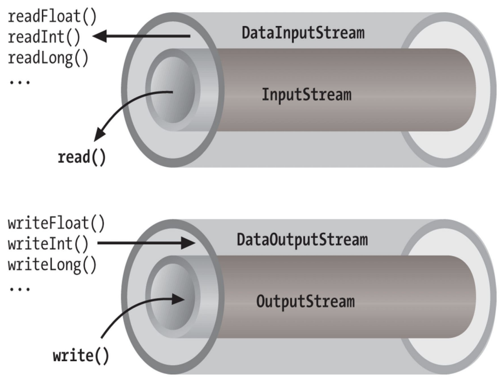

# Unidad 3 - Programación de mecanismos de comunicación en red con sockets

## Modelos de comunicaciones entre procesos

En esta unidad didáctica se van a desarrollar aplicaciones concurrentes apropiadas para sistemas distribuidos. En ellos, los procesos se ejecutan en distintos procesadores de sistemas independientes, y se comunican a través de una red mediante protocolos estándares de comunicaciones.

Podemos encontrar dos modelos de sistemas distribuidos:

- Cliente servidor.
- Entre iguales (P2P).

<center>{ width="700" }</center>

## Modelo TCP/IP

El modelo TCP/IP es una arquitectura de red compleja que integra múltiples protocolos organizados en capas. Sin lugar a dudas, es la arquitectura más utilizada a nivel mundial, ya que constituye la base de Internet y es ampliamente empleada en diversas versiones de sistemas operativos.

La arquitectura TCP/IP se desarrolló diseñando inicialmente los protocolos y luego estructurándolos en capas dentro de la arquitectura. Por esta razón, TCP/IP es frecuentemente referida como una pila de protocolos.

La arquitectura TCP/IP es la más utilizada hoy en día. Se utiliza tanto en redes de área extensa como en redes de área local. Fue creada a principios de los años 70 por el Departamento de Defensa de los Estados Unidos. El objetivo era crear una arquitectura de red con las siguientes características:

* Permitir interconectar redes distintas aunque utilicen distinta tecnología.
* Ser tolerante a fallos. Mantener las comunicaciones a pesar de que se destruya parte de la red.
* Suministrar los servicios de comunicación más utilizados en redes de ordenadores. Finalmente, este proyecto derivó en lo que hoy conocemos como Internet.

Los niveles o capas de este modelo son los siguientes:

1. **Capa de acceso a la red**: El modelo TCP/IP no proporciona detalles específicos sobre esta capa; simplemente establece que debe existir un protocolo que conecte el dispositivo a la red. Esto se debe a que TCP/IP fue diseñado para funcionar sobre diversas redes, por lo que esta capa depende de la tecnología utilizada y no está predefinida. Es importante considerar que una red puede estar interconectada mediante diferentes tipos de cables o de forma inalámbrica. En este nivel se definen los protocolos asociados a los dispositivos de bajo nivel para cada una de estas tecnologías.

2. **Capa de Internet o red**: Esta es la capa más esencial de la arquitectura. Su función es permitir que los dispositivos envíen paquetes de información a la red y que estos viajen de forma independiente hasta su destino. Durante el recorrido, los paquetes pueden atravesar diferentes redes y pueden llegar desordenados. Esta capa no se encarga de reordenar los mensajes en el destino. El protocolo más importante en este nivel es el IP (Internet Protocol), aunque también existen otros protocolos.

3. **Capa de transporte**: Su misión es establecer una comunicación confiable entre el origen y el destino, similar a la capa de transporte en el modelo OSI. Dado que las capas inferiores no gestionan el control de errores ni el ordenamiento de los mensajes, esta capa asume esas responsabilidades. En este nivel se han definido varios protocolos, destacando TCP (Transmission Control Protocol) y UDP (User Datagram Protocol).

4. **Capa de aplicación**: Al igual que en el modelo OSI, esta capa incluye todos los protocolos de alto nivel que utilizan las aplicaciones para comunicarse. Aquí se encuentran protocolos como FTP para la transferencia de archivos, HTTP que utilizan los navegadores para acceder a páginas web, y los protocolos para la gestión del correo electrónico, entre otros.

<center>{ width="700" }</center>

<center>{ width="700" }</center>

## Direcciones, puertos y sockets

### Direcciones IP

Cada host o equipo que está en una red TCP/IP tiene asignada na dirección IP única consistente en un número de red y un número de host. El número de red sirve para identificar la red en la que se encuentran los hosts. El número de
host sirve para identificar a un host dentro de una red.

- Las direcciones Ipv4 son direcciones de 32-bits. La dirección IP se agrupa en cuatro octetos o bytes (grupos de 8 bits) y se representan usando el valor en notación decimal de cada uno de los bytes, separados por puntos. El valor mínimo para cada octeto es 0 y el valor máximo es 255. Por ejemplo: 192.168.0.100
- Las direcciones IPv6 está formadas por 64-bits para la dirección de red o prefijo de red, y otros 64 bits para el número de host. Las direcciones IPv6 se escriben como 8 grupos de 4 dígitos hexadecimales separados por el carácter ':'. Un grupo que sólo tiene ceros puede ser omitido. Los ceros iniciales también se pueden omitir. Por ejemplo: 2001:0db8::1428:57ab

### Puertos

Cuando una aplicación que se está ejecutando en un equipo quiere comunicarse con otra aplicación de otro equipo, se identifica a sí misma con un número de 16 bits, que denominamos puerto. Ese identificador es usado por los protocolos de la capa de transporte (TCP or UDP) para entregar los mensajes a la aplicación correcta dentro del equipo. Los puertos van de 0 a 65535, y se agrupan en tres rangos.

| Grupo de puertos | Rango de puertos | Descripción |
| ----------------| ---------------- | ------------- |
| Puertos bien conocidos o puertos del sistema | 0 - 1023 | Los usan los protocolos estándar y los servicios del SO |
| Puertos registrados | 1024 - 49151 | Reservados por empresas y organizaciones para sus propios servicios | 
| Puertos efímeros | 49152 - 65535 | De libre disposición y uso para aplicaciones cliente y servidor |

### Sockets

Un socket es un punto final de conexión en una comunicación entre procesos y está formado por una combinación única de dirección IP, puerto y protocolo de transporte (normalmente TCP).

Cuando una aplicación cliente quiere comunicarse con un servidor, el SO crea el socket que usará el cliente para recibir la información del servidor. La combinación única de Protocolo + puerto + IP permite que este extremo de la
comunicación sea accesible desde el servidor, de manera inequívoca y asegura que los datos los recibe el proceso que los solicitó.

El servidor tiene su propio socket para comunicarse con el cliente, y una conexión establecida entre el cliente y el servidor usando los dos extremos (los dos sockets cliente <--> servidor). Las aplicaciones intercambian información escribiendo o leyendo en los sockets que han creado.

La conexión usada por un cliente está formada por dos sockets, uno en el lado del cliente y otro en el lado del servidor. Por lo tanto, la conexión puede identificarse con una tupla formada por cuatro número: la dirección IP de origen, la dirección IP de destino, el puerto de origen y el puerto de destino.

## TCP y UDP

El **Protocolo de Control de Transmisión** (Transmission Control Protocol o **TCP**) es un protocolo de la capa de transporte, por lo que su trabajo consiste en permitir la transmisión de paquetes de datos. TCP garantiza que los paquetes se entregan al destinatario de forma ordenada, completa y correcta. Se utiliza para la transferencia de información cuando es necesario garantizar la integridad de esta, como, por ejemplo, en la web o en la transferencia de archivos con FTP. Este protocolo está basado en conexiones, por lo que cuando se establece una comunicación entre dos nodos de la red se crea un cana estable a través del cual se envía la información.

El **Protocolo de Datagramas de Usuario** (User Datagram Protocol o **UDP**) es, al igual que TCP, un protocolo de la capa de transporte que posibilita la transmisión de paquetes de datos. Al contrario que TCP, UDP no está basado en conexiones. Esto significa que cada paquete se envía sin que exista un canal de comunicación abierto con el receptor,
por lo que cada paquete podrá alcanzar su destino por un camino distinto.

Por esta razón, entre otras, los paquetes de datos UDP (conocidos como datagramas) pueden no llegar a su destino en el mismo orden en el que se enviaron o incluso pueden “perderse” y no alcanzarlo. Este comportamiento sin garantías puede resultar llamativo, pero tiene sus ventajas. Al no tener que garantizar la entrega ni el orden, la
comunicación es mucho más rápida que cuando se usa el protocolo TCP, a cambio de aceptar la pérdida de algunos paquetes de información. Esta característica hace que UDP sea el protocolo más adecuado para algunas aplicaciones en las que la rapidez prevalece sobre la fiabilidad, como las transmisiones de voz o de vídeo en tiempo real.

## Clases Java para comunicaciones de red

El paquete java.net proporciona clases que permiten llevar a cabo comunicaciones entre procesos utilizando los protocolos estándares de la familia de TCP/IP. Puede dividirse en dos secciones.

- Clases de bajo nivel, que permiten representar las principales entidades de los niveles de enlace, red y transporte.
- Clases de alto nivel, relacionadas con protocolos de nivel de aplicación, que se verán en la siguiente unidad de trabajo.

<center>{ width="700" }</center>

## Clases Java para interfaces de red

Las interfaces de red presentes en el sistema se pueden mostrar con los comandos _ifconfig_ en Linux o _ipconfig_ en Windows.

La clase **NetworkInterface** tiene métodos estáticos que permiten obtener una enumeración de todas las interfaces de red existentes en el sistema.
Una NetworkInterface puede tener más de una configuración IP asociada, y normalmente al menos una para IPv4 y otra para IPv6. Con distintos métodos de la clase, se pueden obtener para cada una objetos de tipo InterfaceAddress e InetAddress.

La clase InterfaceAddress proporciona información adicional a InetAddress como, por ejemplo, la longitud de la máscara de red y, para una dirección IPv4, la dirección de broadcast de la red a la que pertenece.

### Ejemplo de NetworkInterface

```java
package direccionamiento;

import java.net.InetAddress;
import java.net.InterfaceAddress;
import java.net.NetworkInterface;
import java.net.SocketException;
import java.net.UnknownHostException;
import java.util.ArrayList;
import java.util.Arrays;
import java.util.Collections;
import java.util.Enumeration;

public class NetworkInterfaceExample {

    public static void main(String[] args) throws SocketException,
            UnknownHostException {

        // getNetworkInterfaces() returns a list of all interfaces
        // present in the system.
        ArrayList<NetworkInterface> interfaces = Collections.list(
                NetworkInterface.getNetworkInterfaces());

        System.out.println("Information about present Network Interfaces...\n");
        for (NetworkInterface iface : interfaces) {
            // isUp() method used for checking whether the interface in process
            // is up and running or not.
            if (iface.isUp()) {
                // getName() method
                System.out.println("Interface Name: " + iface.getName());

                // getDisplayName() method
                System.out.println("Interface display name: " + iface.getDisplayName());

                // getHardwareAddress() method
                System.out.println("Hardware Address: "
                        + Arrays.toString(iface.getHardwareAddress()));

                // getParent() method
                System.out.println("Parent: " + iface.getParent());

                // getIndex() method
                System.out.println("Index: " + iface.getIndex());
                // Interface addresses of the network interface
                System.out.println("\tInterface addresses: ");

                // getInterfaceAddresses() method
                for (InterfaceAddress addr : iface.getInterfaceAddresses()) {
                    System.out.println("\t\t" + addr.getAddress().toString());
                }
                // Interface addresses of the network interface
                System.out.println("\tInetAddresses associated with this interface: ");

                // getInetAddresses() method returns list of all
                // addresses currently bound to this interface
                Enumeration<InetAddress> en = iface.getInetAddresses();
                while (en.hasMoreElements()) {
                    System.out.println("\t\t" + en.nextElement().toString());
                }

                // getMTU() method
                System.out.println("\tMTU: " + iface.getMTU());

                // getSubInterfaces() method
                System.out.println("\tSubinterfaces: "
                        + Collections.list(iface.getSubInterfaces()));

                // isLoopback() method
                System.out.println("\tis loopback: " + iface.isLoopback());

                // isVirtual() method
                System.out.println("\tis virtual: " + iface.isVirtual());

                // isPointToPoint() method
                System.out.println("\tis point to point: " + iface.isPointToPoint());

                // supportsMulticast() method
                System.out.println("Supports Multicast: " + iface.supportsMulticast());

            }
        }

        // getByIndex() method returns network interface
        // with the specified index
        NetworkInterface nif = NetworkInterface.getByIndex(1);

        // toString() method is used to display textual
        // information about this network interface
        System.out.println("Network interface 1: " + nif.toString());

        // getByName() method returns network interface
        // with the specified name
        NetworkInterface nif2 = NetworkInterface.getByName("eth0");
        InetAddress ip = InetAddress.getByName("localhost");

        // getbyInetAddress() method
        NetworkInterface nif3 = NetworkInterface.getByInetAddress(ip);
        System.out.println("\nlocalhost associated with: " + nif3);
    }
}
```

[https://docs.oracle.com/en/java/javase/11/docs/api/java.base/java/net/NetworkInterface.html](https://docs.oracle.com/en/java/javase/11/docs/api/java.base/java/net/NetworkInterface.html)

## Clases Java para direcciones IP y resolución de nombres

La clase **InterfaceAddress** representa la configuración IP de una interfaz. Esto incluye la dirección IP y parámetros adicionales, a saber:

- Longitud de la máscara de red, es decir, número de bits que en la dirección IP especifican la red.
- Si se trata de una dirección IPv4, dirección de broadcast para la red a la que pertenece la interfaz.

[https://docs.oracle.com/en/java/javase/11/docs/api/java.base/java/net/InterfaceAddress.html](https://docs.oracle.com/en/java/javase/11/docs/api/java.base/java/net/InterfaceAddress.html)

### Ejemplo InterfaceAddress

```java
package direccionamiento;

import java.net.InterfaceAddress;
import java.net.NetworkInterface;
import java.net.SocketException;
import java.util.List;

public class InterfaceaddressExample
{
    public static void main(String[] args) throws SocketException
    {
        // Modify according to your system
        NetworkInterface nif = NetworkInterface.getByIndex(1);
        List<InterfaceAddress> list = nif.getInterfaceAddresses();

        for (InterfaceAddress iaddr : list)
        {
            // getAddress() method
            System.out.println("getAddress() : " + iaddr.getAddress());

            // getBroadcast() method
            System.out.println("getBroadcast() : " + iaddr.getBroadcast());

            // getNetworkPrefixLength() method
            System.out.println("PrefixLength : " + iaddr.getNetworkPrefixLength());

            // hashCode() method
            System.out.println("Hashcode : " + iaddr.hashCode());

            // toString() method
            System.out.println("toString() : " + iaddr.toString());
        }
    }
}
```

La clase **InetAddress** representa una dirección IP. Tiene dos subclases para representar direcciones IPv4 e IPv6: Inet4Adress e Inet6Adress.

La clase InetAddress tiene métodos estáticos que realizan resolución de nombres. Es decir, dado un nombre, permiten obtener la dirección IP asociada. También tiene métodos que realizan resolución inversa de nombres. Es decir, que permiten obtener un nombre de host a partir de su dirección IP.

[https://docs.oracle.com/en/java/javase/11/docs/api/java.base/java/net/InetAddress.html](https://docs.oracle.com/en/java/javase/11/docs/api/java.base/java/net/InetAddress.html)

### Ejemplo InetAddress

```java
package direccionamiento;

import java.net.InetAddress;
import java.net.UnknownHostException;

class InetAddressExample {

    public static void main(String[] args)
            throws UnknownHostException {
        // To get and print InetAddress of Local Host
        InetAddress address1 = InetAddress.getLocalHost();
        System.out.println("InetAddress of Local Host : "
                + address1);

        // To get and print InetAddress of Named Host
        InetAddress address2
                = InetAddress.getByName("45.22.30.39");
        System.out.println("InetAddress of Named Host : "
                + address2);

        // To get and print ALL InetAddresses of Named Host
        InetAddress address3[]
                = InetAddress.getAllByName("172.19.25.29");
        for (int i = 0; i < address3.length; i++) {
            System.out.println(
                    "ALL InetAddresses of Named Host : "
                    + address3[i]);
        }

        // To get and print InetAddresses of
        // Host with specified IP Address
        byte IPAddress[] = {125, 0, 0, 1};
        InetAddress address4
                = InetAddress.getByAddress(IPAddress);
        System.out.println(
                "InetAddresses of Host with specified IP Address : "
                + address4);

        // To get and print InetAddresses of Host
        // with specified IP Address and hostname
        byte[] IPAddress2
                = {105, 22, (byte) 223, (byte) 186};
        InetAddress address5 = InetAddress.getByAddress(
                "gfg.com", IPAddress2);
        System.out.println(
                "InetAddresses of Host with specified IP Address and hostname : "
                + address5);
    }
}
```

## Clases Java para sockets de UDP

La interfaz Java que da soporte a sockets UDP está constituida por las clases **DatagramPacket** y **DatagramSocket**.

**DatagramSocket** es  la clase utilizada para realizar el envío y la recepción de los datos. A diferencia de los sockets TCP, esta clase no es la encargada de gestionar las direcciones ni de realizar la conexión, sólo se encarga de transportar los datos del origen al destino. Lo único que se hace es enviar los datos, mediante la creación de un socket y utilizando los métodos de envío y recepción apropiados. Esta clase proporciona los métodos **send** y **receive**.

<center>{width="700}</center>

Por su parte, **DatagramPackets** es la encargada de incluir la información que se quiere enviar recibir y la información de direccionamiento, es decir, la dirección a la que se quiere enviar la información que contiene. DatagramPacket contiene la información relevante. Cuando se desea recibir un
datagrama, éste deberá almacenarse bien en un buffer o un array de bytes. Y cuando preparamos un datagrama para ser enviado, el DatagramPacket no sólo debe tener la información, sino que además debe tener la dirección IP y el puerto de destino.

<center>{width="700}</center>

El protocolo de transporte UDP no es orientado a conexión. Solo permite el envío de paquetes de datos individuales, llamados datagramas. Estos pueden llegar en orden distinto al orden en que se enviaron, e incluso no llegar.

El conjunto de un datagrama de UDP encapsulado en un datagrama de IP contiene, además de los datos que se envían del proceso de origen al de destino, la dirección IP y puerto de origen y la dirección IP y puerto de destino. 

<center>{ width="700" }</center>

## Cliente UDP

La forma general de implementar un cliente será:

1. El cliente creará un socket para comunicarse con el servidor. Para enviar datagramas necesita conocer su IP y el puerto por el que escucha.
2. Utilizará el método send() del socket para enviar la petición en forma de datagrama.
    - La información se envía en un objeto de tipo DatagramPacket.
    - El DatagramPacket almacena el contenido del mensaje en un array de bytes.
3. Permanece a la espera de recibir respuesta.
4. El cliente recibe la respuesta del servidor mediante el método receive() del socket.
    - La información se recibe en un objeto de tipo DatagramPacket.
    - El DatagramPacket almacena el contenido del mensaje en un array de bytes.
5. Cerrar y liberar los recursos.

## Servidor UDP

1. El servidor crea un socket asociado a un puerto local para escuchar peticiones de clientes.
2. Permanece a la espera de recibir peticiones.
3. El servidor recibe las peticiones mediante el método receive() del socket.
    - La información se recibe en un objeto de tipo DatagramPacket.
    - El DatagramPacket almacena el contenido del mensaje en un array de bytes.
4. En el datagrama recibido va incluido además del mensaje, el puerto y la IP del cliente emisor de la petición; lo que le permite al servidor conocer la dirección del emisor del datagrama. Utilizando el método send() del socket puede enviar la respuesta al cliente emisor.
5. El servidor permanece a la espera de recibir más peticiones.
6. Cerrar y liberar los recursos.

## Cliente/Servidor UDP

<center>{ width="700" }</center>

### Ejemplo cliente/servidor con UDP

ServidorUDP.java

```java
package udp;

import java.net.DatagramPacket;
import java.net.DatagramSocket;

public class ServidorUDP {

    public static void main(String[] argv) throws Exception {
    // Buffer para recibir el datagrama
        byte[] bufer = new byte[1024];
    // El Socket del servidor se asocia a un puerto para que los clientes
    // puedan enviar peticiones.
        DatagramSocket socket = new DatagramSocket(12345);
    // Se espera la llegada de un DATAGRAMA
    // Al igual que con TCP, esta llamada a receive es bloqueante
    // y es la que tiene que marcar la sincronización entre lecturas y
    // escrituras de las app cliente / servidor
        System.out.println("Esperando Datagrama ................");
    // Se crea el objeto que almacenará el mensaje enviado por el cliente
        DatagramPacket datagramaRecibido = new DatagramPacket(bufer, bufer.length);
    // Se espera el mensaje y se le pasa el datagrama para que lo almacene ahí
        socket.receive(datagramaRecibido);
        String mensajeRecibido = new String(datagramaRecibido.getData());
    //Información recibida
        System.out.println("Número de Bytes recibidos: " + datagramaRecibido.getLength());
        System.out.println("Contenido del Paquete : " + mensajeRecibido.trim());
        System.out.println("Puerto origen del mensaje: " + datagramaRecibido.getPort());
        System.out.println("IP de origen : " + datagramaRecibido.getAddress().getHostAddress());
        System.out.println("Puerto destino del mensaje:" + socket.getLocalPort());
    // Liberamos los recursos
        socket.close();
    }
}
```

ClienteUDP.java

```java
package udp;

import java.net.DatagramPacket;
import java.net.DatagramSocket;
import java.net.InetAddress;

public class ClienteUDP {

    public static void main(String[] argv) throws Exception {
    // IP y puerto al que se envía el Datagrama
        InetAddress destino = InetAddress.getLocalHost();
        int port = 12345;
    // Buffer para recibir el datagrama
        byte[] buffer = new byte[1024];
    // El mensaje a enviar en el Datagrama se convierte a bytes
        String mensajeEnviado = "Enviando Saludos !!";
        buffer = mensajeEnviado.getBytes(); //codifico String a bytes
    // Se preparara el DatagramPacket que se va a enviar
        DatagramPacket datagramaEnviado = new DatagramPacket(buffer, buffer.length, destino, port);
    // En este caso, especificamos un puerto, aunque podríamos dejarlo para
    // que el SO asigne uno libre
        DatagramSocket socket = new DatagramSocket(34567);
        System.out.println("Host destino : " + destino.getHostName());
        System.out.println("IP Destino : " + destino.getHostAddress());
        System.out.println("Puerto local del socket: " + socket.getLocalPort());
        System.out.println("Puerto al que envio: " + datagramaEnviado.getPort());
    // Envío del Datagrama
        socket.send(datagramaEnviado);
    // Cierre y liberación de recursos
        socket.close();
    }
}
```

### Otro ejemplo de cliente/servidor con UDP

ServidorUDP2.java

```java
package udp2;

import java.net.DatagramPacket;
import java.net.DatagramSocket;
import java.net.InetAddress;

public class ServidorUDP2 {

    public static void main(String args[]) throws Exception {
    //Puerto por el que escucha el servidor: 9876
        DatagramSocket serverSocket = new DatagramSocket(9876);
        byte[] recibidos = new byte[1024];
        byte[] enviados = new byte[1024];
        String cadena;
        while (true) {
            System.out.println("Esperando datagrama.....");
    //RECIBO DATAGRAMA
            recibidos = new byte[1024];
            DatagramPacket paqRecibido = new DatagramPacket(recibidos, recibidos.length);
            serverSocket.receive(paqRecibido);
            cadena = new String(paqRecibido.getData());
    //DIRECCION ORIGEN
            InetAddress IPOrigen = paqRecibido.getAddress();
            int puerto = paqRecibido.getPort();
            System.out.println("\tOrigen: " + IPOrigen + ":" + puerto);
            System.out.println("\tMensaje recibido: " + cadena.trim());
    //CONVERTIR CADENA A MAYÚSCULA
            String mayuscula = cadena.trim().toUpperCase();
            enviados = mayuscula.getBytes();
    //ENVIO DATAGRAMA AL CLIENTE
            DatagramPacket paqEnviado = new DatagramPacket(enviados, enviados.length, IPOrigen, puerto);
            serverSocket.send(paqEnviado);
    // Condición de finalización
            if (cadena.trim().equals("*")) {
                break;
            }
        }//Fin de while
        serverSocket.close();
        System.out.println("Socket cerrado...");
    }
}
```

ClienteUDP2.java

```java
package udp2;

import java.io.BufferedReader;
import java.io.InputStreamReader;
import java.net.DatagramPacket;
import java.net.DatagramSocket;
import java.net.InetAddress;

public class ClienteUDP2 {

    public static void main(String args[]) throws Exception {
    // FLUJO PARA ENTRADA ESTANDAR
        BufferedReader in = new BufferedReader(new InputStreamReader(System.in));
        DatagramSocket clientSocket = new DatagramSocket();
        byte[] enviados = new byte[1024];
        byte[] recibidos = new byte[1024];
    // DATOS DEL SERVIDOR al que enviar mensaje
        InetAddress IPServidor = InetAddress.getLocalHost();// localhost
        int puerto = 9876; // puerto por el que escucha
    // INTRODUCIR DATOS POR TECLADO
        System.out.print("Introduce mensaje: ");
        String cadena = in.readLine();
        enviados = cadena.getBytes();
    // ENVIANDO DATAGRAMA AL SERVIDOR
        System.out.println("Enviando " + enviados.length + " bytes al servidor.");
        DatagramPacket envio = new DatagramPacket(enviados, enviados.length, IPServidor, puerto);
        clientSocket.send(envio);
    // RECIBIENDO DATAGRAMA DEL SERVIDOR
        DatagramPacket recibo = new DatagramPacket(recibidos, recibidos.length);
        System.out.println("Esperando datagrama....");
        clientSocket.receive(recibo);
        String mayuscula = new String(recibo.getData());
    // OBTENIENDO INFORMACIÓN DEL DATAGRAMA
        InetAddress IPOrigen = recibo.getAddress();
        int puertoOrigen = recibo.getPort();
        System.out.println("\tProcedente de: " + IPOrigen + ":" + puertoOrigen);
        System.out.println("\tDatos: " + mayuscula.trim());
    //cerrar socket
        clientSocket.close();
    }
}
```

## MulticastSocket

La clase MulticastSocket es útil para enviar paquetes a múltiples destinos simultáneamente. Para poder recibir estos paquetes es necesario establecer un grupo multicast, que es un grupo de direcciones IP que comparten el mismo número de puerto.

Cuando se envía un mensaje a un grupo de multicast, todos los que pertenezcan a ese grupo recibirán el mensaje. La pertenencia al grupo es transparente al emisor, es decir, el
emisor no conoce el número de miembros del grupo ni sus direcciones IP.

Un grupo multicast se especifica mediante una dirección IP de clase D y un número de puerto UDP estándar. Las direcciones desde la 224.0.0.0 a la 239.255.255.255 están destinadas para ser direcciones de multicast. La dirección 224.0.0.0 está reservada y no debe ser utilizada.

<center>{width="700"}</center>

### Ejemplo de Multicast con UDP

MulticastServidor.java

```java
package multicast;

import java.net.DatagramPacket;
import java.net.InetAddress;
import java.net.MulticastSocket;
import java.util.Scanner;

public class MulticastServidor {

    public static void main(String args[]) throws Exception {
        // Enviamos la información introducida por teclado hasta que se envíe un *
        Scanner in = new Scanner(System.in);
        //Se crea el socket multicast.
        MulticastSocket ms = new MulticastSocket();
        // Se escoge un puerto para el server
        int puerto = 12345;
        // Se escoge una dirección para el grupo
        InetAddress grupoMulticast = InetAddress.getByName("225.0.0.1");
        String cadena = "";
        while (!cadena.trim().equals("*")) {
            System.out.print("Datos a enviar al grupo: ");
            cadena = in.nextLine();
            // Enviamos el mensaje a todos los clientes que se hayan unido al grupo
            DatagramPacket paquete = new DatagramPacket(cadena.getBytes(), cadena.length(), grupoMulticast, puerto);
            ms.send(paquete);
        }
        // Cerramos recursos
        ms.close();
        System.out.println("Socket cerrado...");
    }
}
```

MulticastCliente.java

```java
package multicast;

import java.net.DatagramPacket;
import java.net.InetAddress;
import java.net.MulticastSocket;

public class MulticastCliente {

    public static void main(String args[]) throws Exception {
        // El puerto debe ser el mismo en todos los clientes, ya que el
        // Se crea el socket multicast
        // servidor multicast envía la información a la IP multicast y a un puerto
        int puerto = 12345;//Puerto multicast
        MulticastSocket ms = new MulticastSocket(puerto);
        //Nos unimos al grupo multicast
        InetAddress grupo = InetAddress.getByName("225.0.0.1");
        ms.joinGroup(grupo);
        //ms.joinGroup(mcastaddr, netIf);
        String msg = "";
        while (!msg.trim().equals("*")) {
            // El buffer se crea dentro del bucle para que se sobrescriba
            // con cada nuevo mensaje
            byte[] buf = new byte[1000];
            DatagramPacket paquete = new DatagramPacket(buf, buf.length);
            //Recibe el paquete del servidor multicast
            ms.receive(paquete);
            msg = new String(paquete.getData());
            System.out.println("Recibo: " + msg.trim());
        }
        // Abandonamos grupo
        ms.leaveGroup(grupo);
        //ms.leaveGroup(mcastaddr, netIf);
        // Cerramos recursos
        ms.close();
        System.out.println("Socket cerrado...");
    }
}
```

## Clases Java para sockets TCP

La interfaz Java que da soporte a sockets TCP está constituida por las clases ServerSocket y Socket.

- ServerSocket: es utilizada por un servidor para crear un socket en el puerto en el que escucha las peticiones de conexión de los clientes. Su método accept toma una petición de conexión de la cola, o si la cola está vacía, se bloquea hasta que llega una petición. El resultado de ejecutar
accept es una instancia de Socket, a través del cual el servidor tiene acceso a los datos enviados por el cliente.
- Socket: es utilizada tanto por el cliente como por el servidor. El cliente crea un socket especificando el nombre DNS del host y el puerto del servidor, así se crea el socket local y además se conecta con el servicio. Esta clase proporciona los métodos getInputStream y getOutputStream
para acceder a los dos streams asociados a un socket (recordemos que son bidireccionales), y devuelve tipos de datos InputStream y OutputStream, respectivamente, a partir de los cuales podemos construir
BufferedReader y PrintWriter , respectivamente, para poder procesar los datos de forma más sencilla.

### Cliente TCP

Si nos centramos en la parte de comunicaciones, la forma general de implementar un cliente será:

1. Crear un objeto de la clase Socket, indicando host y puerto donde corre el servicio.
2. Obtener las referencias al stream de entrada y al de salida al socket.
3. Leer desde y escribir en el stream de acuerdo al protocolo del servicio. Para ello emplear alguna de las facilidades del paquete java.io.
4. Cerrar los streams.
5. Cerrar el socket.

Hay dos formas mayoritarias de enviar y recibir la información a través de los streams que proporciona un socket. A través de los streams enviamos bytes, que es la forma más básica de generar información, bien sea a través de la red o entre procesos. Como es complicado gestionar a nivel de bytes toda la información que queremos enviar o recibir, usamos Decorators o Wrappers para enviar tipos de datos de un nivel de abstracción mayor.

Sin embargo, puede haber ocasiones en las que nos interese trabajar con
tipos de datos. DataInputStream y DataOutputStream proporcionan métodos para leer y escribir Strings y todos los tipos de datos primitivos de Java, incluyendo números y valores booleanos.

DataOutputStream codifica esos valores de forma independiente de la máquina y los envía al stream de más bajo nivel para que los gestione como bytes. DataInputStream hace lo contrario.

<center>{width="700"}</center>

### Servidor TCP

La forma de implementar un servidor será:

1. Crear un objeto de la clase ServerSocket para escuchar peticiones en el puerto asignado
al servicio.
2. Esperar solicitudes de clientes.
3. Cuando se produce una solicitud:
    - Aceptar la conexión obteniendo un objeto de la clase Socket
    - Obtener las referencias al stream de entrada y al de salida al socket anterior.
    - Leer datos del socket, procesarlos y enviar respuestas al cliente, escribiendo en el stream del socket. Para ello emplear alguna de las funcionalidades del paquete java.io.
4. Cerrar los streams.
5. Cerrar los sockets.

<center>{width="700"}</center>

### Cliente/Servidor TCP

La comunicación a través de un socket de comunicación se realiza en forma de una secuencia de bytes.

TCP permite que los datos se reciban en el proceso de destino en el mismo orden en que se envían desde el proceso de origen. Por ello, en Java se utilizan streams tanto para el envío como para la recepción de datos a través de un socket de TCP (OutputStream e InputStream). Se utilizan las clases Socket y ServerSocket.

<center>{width="700"}</center>

### Servidor multihilo

Si queremos que un servidor pueda atender varias peticiones de forma simultánea, debemos usar hilos para dotarlo de esa capacidad.

El flujo básico ahora cambiaría para adaptarse a este formato:

```
while (true) {
Aceptar la conexión obteniendo un objeto de la clase Socket;
Crear un thread para que se encargue de la comunicación con ese cliente, es
decir, para que gestione el socket obtenido en el accept.;
}
```

El servidor multihilo crea un nuevo hilo que se encarga de las operaciones de E/S con el cliente. Mientras tanto puede esperar la conexión de nuevos clientes con los que volverá a hacer lo mismo.

El servidor multihilo se ayuda de una clase Worker que hereda de Thread, pudiendo así ejecutarse concurrentemente con el hilo principal.

Esta clase Worker es la encargada de realizar toda la comunicación con el cliente y el servidor. Para poder hacerlo, en su constructor recibe el Socket que se crea cuando se recibe la conexión de un cliente ServerSocket.accept().

<center>{width="700"}</center>