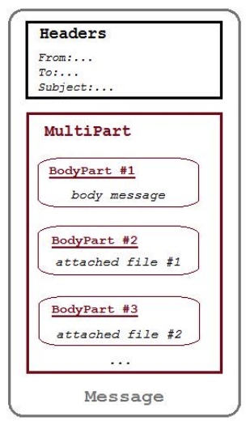

# Unidad 4 - Generación de servicios en red

Como hemos visto anteriormente, el modelo TCP/IP está compuesto por cuatro (o cinco) capas o niveles. La capa de aplicación define las aplicaciones de red y los servicios de Internet estándar que puede utilizar un usuario. Estos servicios utilizan la capa de transporte para enviar y recibir datos.

## Protocolos estándar de comunicación en red

Existen varios protocolos de capa de aplicación:

- **TELNET** (Telecommunication Network): Emulación de terminal. Permite a un usuario acceder a una máquina remota y manejarla como si estuviese sentado delante de ella.
- **SMTP** (Simple Mail Transfer Protocol): Protocolo simple de transferencia de correo electrónico; es probablemente el servicio
más popular entre los usuarios de la red. Este estándar especifica el formato exacto de los mensajes que un cliente en una máquina debe enviar al servidor en otra. Administra la transmisión de correo electrónico a través de las redes informáticas.
- **FTP** (File Transfer Protocol): Protocolo de transferencia de ficheros. Es un servicio confiable orientado a conexión que se utiliza para transferir ficheros de una máquina a otra a través de Internet.
- **HTTP** (HyperText Transference Protocol): Protocolo de Transferencia de Hipertexto. Utilizado por los navegadores web para realizar peticiones a los servidores web y para recibir las respuestas de ellos.
- **POP3** (Post Office Protocol, version 3). Protocolo para entrega de correo electrónico a un agente de usuario de correo.
- **DNS**  (Domain Name System): Sistema de nombres de dominio. Es un sistema que usa servidores distribuidos a lo largo de la red para resolver el nombre de un host IP en una dirección IP.

## Correo: Jakarta Mail

**Jakarta Mail** (anteriormente conocido como JavaMail) es una API para enviar y recibir correos electrónicos a través de SMTP, POP3 e IMAP, y es la opción más popular que también admite la autenticación TLS y SSL. Es independiente de la plataforma, del protocolo y se encuentra integrado en la plataforma Jakarta EE.

La API de correo de Jakarta tiene una amplia gama de clases e interfaces que se pueden usar para enviar, leer y realizar otras acciones con mensajes de correo electrónico, al igual que en una aplicación de correo estándar. 

Aunque hay varios paquetes en el proyecto de Jakarta Mail, los más utilizados son **jakarta.mail** y **jakarta.mail.internet**. El paquete jakarta.mail proporciona clases que modelan un sistema de correo, y el paquete jakarta.mail.internet proporciona clases que se centran en los sistemas de correo de Internet.

[https://jakarta.ee/specifications/mail/2.1/jakarta-mail-spec-2.1](https://jakarta.ee/specifications/mail/2.1/jakarta-mail-spec-2.1)

### Clases principales de Jakarta Mail

#### jakarta.mail.Session

La clase Session, que no tiene subclases, es la clase de nivel superior de la API de correo de Jakarta. Es un objeto multiproceso que actúa como fábrica
de conexiones para la API de correo de Jakarta. Además de recopilar las propiedades y los valores predeterminados de la API de correo, es responsable de los ajustes de configuración y la autenticación. 

Para obtener el objeto Session, puede llamar a cualquiera de los dos métodos siguientes:

- **getDefaultInstance()**, que devuelve la sesión predeterminada.
- **getInstance()**, que devuelve una nueva sesión.

#### jakarta.mail.Message

La clase Message es una clase abstracta que modela un mensaje de correo electrónico. Sus subclases soportan las implementaciones reales. Por lo general, su subclase MimeMessage (jakarta.mail.internet.MimeMessage) se utiliza para preparar los detalles del mensaje de correo electrónico que se enviará.

| Método | Descripción |
| --- | --- | 
| setFrom(Address addresses) | Se utiliza para establecer el campo de encabezado "De" |
| setRecipients(Message.RecipientType type, String addresses) | Se utiliza para establecer el tipo de destinatario indicado en las direcciones proporcionadas |
| setSubject(String subject) | Se utiliza para establecer el campo de encabezado del asunto del correo electrónico |
| setText(String text) | Se utiliza para establecer la cadena proporcionada como contenido del correo electrónico, utilizando el tipo MIME de "texto / sin formato" |
| setContent(Object message, String contentType) | Se utiliza para establecer el contenido del correo electrónico y se puede utilizar con un tipo MIME que no sea "text/html" |

#### jakarta.mail.Address

La clase Address es una clase abstracta que modela las direcciones (direcciones To y From) en un mensaje de correo electrónico; Sus subclases soportan las implementaciones reales. Por lo general, su subclase InternetAddress , que denota una dirección de correo electrónico de Internet, es la que más se usa.

#### jakarta.mail.Authenticator

La clase Authenticator es una clase abstracta que se utiliza para obtener autenticación para acceder a los recursos del servidor de correo, a menudo requiriendo la información del usuario. Por lo general, su subclase PasswordAuthentication es la que más se usa.

#### jakarta.mail.Transport

La clase Transport es una clase abstracta que utiliza el protocolo SMTP para enviar y transportar mensajes de correo electrónico.

### Enviar correos en Jakarta Mail

Estos son los pasos para enviar un email utilizando la API de correo de Jakarta:

1. Configurar detalles del servidor SMTP utilizando un objeto Java Properties. Se pueden obtener detalles del servidor SMTP del proveedor de servicios de correo electrónico.
2. Crear un objeto Session llamando al método getInstance(). Luego, pasar el nombre de usuario y contraseña de la cuenta a PasswordAuthentication. Al crear el objeto de sesión, siempre s debe registrar el Authenticator con la sesión.
3. Una vez creado el objeto Session, el siguiente paso es crear el email que se enviará. Para ello, se comienza pasando el objeto de sesión creado al constructor de clase MimeMessage.
4. A continuación, después de crear el objeto de mensaje, establecer los campos De, Para y Asunto del email.
5. Utilizar el método setText() para establecer el contenido del mensaje de correo electrónico.
6. Utilizar el objeto Transport para enviar el correo.
7. Agregar excepciones para recuperar los detalles de cualquier posible error al enviar el mensaje.

#### Enviar mensajes HTML

En términos de usabilidad, el contenido HTML es muy superior al texto sin formato. Por lo tanto, la mayoría de las veces enviamos emails en formato HTML. Java Mail API admite el envío de correos electrónicos en formato HTML. Para enviar un correo electrónico con contenido HTML, debemos reemplazar el método message.setText() con el siguiente código.

```Java
message.setContent("Just discovered that Jakarta Mail is fun and easy to use", "text/html");
```

Usaremos el método setContent() para establecer el contenido y especificar "text/html" en el segundo argumento, lo que indica que el mensaje tiene formato HTML.

#### Enviar correos electrónicos con archivos adjuntos

Además de los pasos mencionados anteriormente, estos son los diferentes pasos involucrados en el uso de la API de
correo de Jakarta para enviar archivos adjuntos de correo electrónico:

1. Creamos una instancia del objeto MimeMultipart que se utilizará como envoltorio o wrapper para las distintas
partes MimeBodyPart. Un MultiPart actúa como un contenedor que guarda varias partes individuales, y viene con métodos para obtener y configurar sus diversas subpartes.
2. Luego, establecemos la primera parte del objeto Multipart pasándole el mensaje real.
3. A continuación, establecemos la segunda y las siguientes parte del objeto Multipart agregando los datos adjuntos.
4. Incluimos el objeto Multipart en el mensaje a enviar.
5. Enviamos el mensaje.

<center>{width="300"}</center>

#### Enviar correos electrónicos HTML con imágenes

Para agregar una imagen a su correo electrónico HTML en Jakarta Mail, se pueden elegir cualquiera de las tres opciones comunes:

- Insertando imágenes CID. Para ello debemos crear un mensaje MIME multipart/related.
- Insertando imágenes en línea o codificación Base64. Para la inserción en línea o la codificación Base64, se debe incluir los datos de imagen codificados en el cuerpo HTML de forma similar a esta:

```html

```

- Enlazando imágenes. Tenemos imágenes vinculadas que son esencialmente imágenes alojadas en algún servidor externo al que luego crea un enlace. Podemos hacerlo usando la etiqueta img en el cuerpo HTML de la siguiente manera.

```html

```

### Lectura de correos electrónicos en Jakarta Mail

El API de correo de Jakarta también proporciona soporte para leer correos electrónicos. Para leer correos electrónicos, debe usar la clase javax.mail.Store. La clase Store es una clase abstracta que modela un almacén de mensajes y su protocolo de acceso, y es una subclase de las clases POP3Store e IMAPStore. Leer correos electrónicos almacenados en un servidor IMAP consta de los siguientes pasos:

- Creación de la sesión IMAP (Session), indicando el protocolo, el nombre del host, el puerto, si usa SSL y el servidor de autenticación asociado.
- Configuración y obtención del almacén (Store).
- Obtención de la conexión a través del almacén, indicando el identificador de la cuenta y la contraseña.
- Obtención de la carpeta a leer.
- Apertura de la carpeta.
- Obtención de los mensajes.
- Procesamiento de mensajes.
- Cierre de la carpeta y del almacén.
- Cierre de la sesión y de la conexión.

### Ejemplo de uso de Jakarta Mail para el envío y lectura de correos electrónicos

EnviarCorreo.java

```java
import jakarta.mail.Message;
import jakarta.mail.MessagingException;
import jakarta.mail.Multipart;
import jakarta.mail.PasswordAuthentication;
import jakarta.mail.Session;
import jakarta.mail.Transport;
import jakarta.mail.internet.AddressException;
import jakarta.mail.internet.InternetAddress;
import jakarta.mail.internet.MimeBodyPart;
import jakarta.mail.internet.MimeMessage;
import jakarta.mail.internet.MimeMultipart;
import java.io.IOException;
import java.io.InputStream;
import java.util.Properties;

public class EnviarCorreo {

    public static void main(String[] args) throws AddressException, MessagingException, IOException {

        final Properties prop = new Properties();
        prop.put("mail.smtp.username", "username@gmail.com");
        prop.put("mail.smtp.password", "contraseña generada en la configuración de gmail");
        prop.put("mail.smtp.host", "smtp.gmail.com");
        prop.put("mail.smtp.port", "587");
        prop.put("mail.smtp.auth", "true");
        prop.put("mail.smtp.starttls.enable", "true"); // TLS
        prop.put("mail.debug", "true");

// Create the Session with the user credentials
        Session mailSession = Session.getInstance(prop, new jakarta.mail.Authenticator() {
            @Override
            protected PasswordAuthentication getPasswordAuthentication() {
                return new PasswordAuthentication(prop.getProperty("mail.smtp.username"),
                        prop.getProperty("mail.smtp.password"));
            }
        });
        // Prepare the MimeMessage
        Message message = new MimeMessage(mailSession);
// Set From and subject email properties
        message.setFrom(new InternetAddress("username@gmail.com"));
        message.setSubject("Sending Mail with pure Jakarta Mail API ");

// Set to, cc & bcc recipients        
        InternetAddress[] toEmailAddresses
                = InternetAddress.parse("username@gmail.com");
        InternetAddress[] ccEmailAddresses
                = InternetAddress.parse("correo1@gmail.com");
        InternetAddress[] bccEmailAddresses
                = InternetAddress.parse("correo2@gmail.com");

        message.setRecipients(Message.RecipientType.TO, toEmailAddresses);
        message.setRecipients(Message.RecipientType.CC, ccEmailAddresses);
        message.setRecipients(Message.RecipientType.BCC, bccEmailAddresses);

//Mail body with plain Text
 /* message.setText("Hello User,"
                + "\n\n If you read this, means mail sent with Java Mail API is successful");*/

//Mail body with HTML
        /* message.setContent("Just discovered that Jakarta Mail is fun and easy to use",
                "text/html");*/

//Mail with attached files
/*
    // create an instance of multipart object
        Multipart multipart = new MimeMultipart();

    // create the 1st message body part
        MimeBodyPart messageBodyPart = new MimeBodyPart();
    // Add a plain message (HTML can also be added with setContent)
        messageBodyPart.setText("Please find the attachment sent using Jakarta Mail");
    // Add the BodyPart to the Multipart object
        multipart.addBodyPart(messageBodyPart);

    // 2nd. bodyPart with an attached file
        messageBodyPart = new MimeBodyPart();
        String filename = "File.pdf";
        messageBodyPart.attachFile(filename);
    // Add the BodyPart to the Multipart object
        multipart.addBodyPart(messageBodyPart);

    // Add the multipart object to the message
        message.setContent(multipart);
         */

//Mail with images

//An HTML code with a link referenced image
        Multipart multipart = new MimeMultipart("related");
        MimeBodyPart htmlPart = new MimeBodyPart();
//add reference to your image to the HTML body 
        String messageBody = "<p></p></p>";
        htmlPart.setText(messageBody, "utf-8", "html");
// Add the BodyPart to the Multipart object
        multipart.addBodyPart(htmlPart);
// Add the multipart object to the message
        message.setContent(multipart);
        
       
// Send the configured message in the session
        Transport.send(message);
    }
}
```

LeerCorreo.java

```java
import jakarta.mail.Folder;
import jakarta.mail.Message;
import jakarta.mail.MessagingException;
import jakarta.mail.NoSuchProviderException;
import jakarta.mail.PasswordAuthentication;
import jakarta.mail.Session;
import jakarta.mail.Store;
import java.io.IOException;
import java.util.Properties;

public class Leercorreo {

    public static void main(String[] args) throws NoSuchProviderException,
            MessagingException, IOException {

        final Properties prop = new Properties();
        prop.put("mail.imap.username", "username@gmail.com");
        prop.put("mail.imap.password", "contraseña generada en la configuración de gmail");
        prop.put("mail.imap.host", "imap.gmail.com");
        prop.put("mail.imap.port", "993");
        prop.put("mail.imap.ssl.enable", "true");
        prop.put("mail.imap.auth", "true");
       // prop.put("mail.debug", "true");

        // Create the Session with the user credentials
        Session mailSession = Session.getInstance(prop, new jakarta.mail.Authenticator() {
            @Override
            protected PasswordAuthentication getPasswordAuthentication() {
                return new PasswordAuthentication(prop.getProperty("mail.imap.username"),
                        prop.getProperty("mail.imap.password"));
            }
        });

        // Get the Store object and connect to the current host using the specified username and password.
        Store store = mailSession.getStore("imap");
        store.connect(prop.getProperty("mail.imap.host"),
                prop.getProperty("mail.imap.username"),
                prop.getProperty("mail.imap.password"));

        // Get the folder and open it
        Folder folder = store.getFolder("INBOX");
        folder.open(Folder.READ_ONLY);

        // Get the messages
        Message[] messages = folder.getMessages();

        // Process the messages
        for (int i = 0; i < messages.length; i++) {
            Message message = messages[i];
            System.out.println("Message " + (i + 1));
            System.out.println("From: " + message.getFrom()[0]);
            System.out.println("Subject: " + message.getSubject());
            System.out.println("Sent Date: " + message.getSentDate());
            System.out.println("Text: " + message.getContent().toString());
        }

        // Close the folder and store objects
        folder.close(false);
        store.close();

    }

}
```


## FTP: Apache Commons Net

La librería Apache Commons Net implementa el lado de muchos protocolos básicos de Internet.

El propósito de la biblioteca es proporcionar acceso a protocolos fundamentales, no abstracciones de alto nivel. Por lo tanto, algunos de los diseños violan los principios de diseño orientado a objetos.

Nuestra filosofía es hacer que la funcionalidad global de un protocolo sea accesible (por ejemplo, TFTP envía archivo y recibe archivo) cuando sea posible,
pero también proporcionar acceso a los protocolos fundamentales cuando corresponda para que el programador pueda construir sus propias implementaciones personalizadas.

En Java, de forma nativa, es posible realizar transferencias de archivos utilizando este protocolo, pero es extremadamente difícil hacerlo. La librería Apache Commons Net proporciona clases y utilidades para realizar cualquier operación sobre un servidor FTP o FTPS desde un cliente Java.

Esta librería se puede descargar desde la página web de apache.org a través del siguiente enlace: 

[https://commons.apache.org/proper/commons-net/](https://commons.apache.org/proper/commons-net/)

### Conexión y autenticación

Los pasos para conectarnos a un servidor FTP utilizando la librería Apache Commons Net serían:

1. Crear una instancia de la clase FTPClient y llamar al método connect, pasando como parámetros el servidor y el puerto al que
queremos conectarnos.
2. A continuación, tendremos que comprobar que la conexión se ha establecido correctamente, para ello debemos llamar al método getReplyCode y comprobar que el valor devuelto por este método es positivo.
3. Por último, tendremos que llamar al método login, pasando como parámetros el usuario y la contraseña con la que queremos iniciar sesión.

### Cambio de directorios

Para mostrar el directorio de trabajo actual, podemos utilizar el método printWorkingDirectory y para mostrar el contenido del directorio de trabajo
actual, podemos utilizar el método listFiles o el método listNames.

```java
// Obtener el directorio de trabajo remoto actual
String workingDirectory = ftp.printWorkingDirectory();

// Mostrar el contenido del directorio de trabajo remoto actual
for (String name : ftp.listNames()) {
    System.out.println(name);
}

// Cambiar el directorio de trabajo remoto actual
ftp.changeWorkingDirectory(fileName)
```

Para mostrar el directorio de trabajo local actual, tenemos que gestionarlo con la clase File y sus métodos.

```java
// Obtener el directorio de trabajo local actual
String workingDirectory = System.getProperty("user.dir");

// Mostrar el contenido del directorio de trabajo local actual
File file = new File(workingDirectory);
for (String name : file.list()) {
    System.out.println(name);
}

// Cambiar el directorio de trabajo local actual
System.setProperty("user.dir", fileName);
```

### Enviar y descargar archivos al servidor

En FTP los archivos se pueden cargar de dos formas diferentes:

Envío:

- Modo ASCII: el archivo se carga como texto, con las terminaciones de línea convertidas al estándar de red.
- Modo binario: el archivo se carga tal, sin ninguna conversión.

Descarga:

- Modo ASCII: el archivo se descarga como texto, con las terminaciones de línea convertidas al estándar local
- Modo binario: el archivo se descarga tal cual, sin ninguna conversión.


```java
public boolean sendTextFile(String fileName) throws FileNotFoundException, IOException {
    ftp.setFileType(FTP.ASCII_FILE_TYPE);
    File file = new File(getLocalWorkingDirectory() + "/" + fileName);
    String fileRemote = fileName;

    InputStream input = new FileInputStream(file);
    boolean upload = ftp.storeFile(fileRemote, input);

    input.close();

    return upload;
}
```


```java
public boolean getTextFile(String fileName) throws IOException {
    ftp.setFileType(FTP.ASCII_FILE_TYPE);

    // The getLocalWorkingDirectory() it's a custom method (not from the Apache Commons library)
    // that returns the path to the local file we want to download
    File file = new File(getLocalWorkingDirectory() + "/" + fileName);

    // The file name in the server can be different from the local file name
    String fileRemote = fileName;

    OutputStream output = new FileOutputStream(file);
    boolean download = ftp.retrieveFile(fileRemote, output);
    
    output.close();
    
    return download;
}
```

```java
public boolean sendBinaryFile(String fileName) throws IOException {
    ftp.setFileType(FTP.BINARY_FILE_TYPE);
    File file = new File(getLocalWorkingDirectory() + "/" + fileName);
    String fileRemote = fileName;
    InputStream input = new FileInputStream(file);
    OutputStream output = ftp.storeFileStream(fileRemote);
    byte[] bytesIn = new byte[4096];
    int read = 0;

    while ((read = input.read(bytesIn)) != -1) {
        output.write(bytesIn, 0, read);
    }

    input.close();
    output.close();
    boolean upload = ftp.completePendingCommand();
    
    return upload;
}
```

```java
public boolean getBinaryFile(String fileName) throws IOException {
    ftp.setFileType(FTP.BINARY_FILE_TYPE);

    // The getLocalWorkingDirectory() it's a custom method (not from the Apache Commons library)
    // that returns the path to the local file we want to download

    File file = new File(getLocalWorkingDirectory() + "/" + fileName);

    // The file name in the server can be different from the local file name
    String fileRemote = fileName;
    OutputStream output = new FileOutputStream(file);
    InputStream input = ftp.retrieveFileStream(fileRemote);
    byte[] bytesIn = new byte[4096];
    int read = 0;

    while ((read = input.read(bytesIn)) != -1) {
        output.write(bytesIn, 0, read);
    }
    
    boolean download = ftp.completePendingCommand();
    
    input.close();
    output.close();
    
    return download;
}
```

### Otras acciones

#### Mostrar información de los archivos y propiedades de los archivos

```java
public void showFileInfo(String fileName) throws IOException {
    FTPFile[] files = ftp.listFiles(fileName);

    for (FTPFile file : files) {
        System.out.println(file.getName());
        System.out.println(file.getTimestamp().getTime());
        System.out.println(file.getSize());

        if (f.getType() == FTPFile.FILE_TYPE) {
            tipo = "File";
        }
        
        if (f.getType() == FTPFile.DIRECTORY_TYPE) {tipo = "Folder";}
    }
}   
```

#### Añadir y eleminar directores FTP remotos

```java
public void addRemoteDirectory(String directory) throws IOException {
    ftp.makeDirectory(directory);
}

public void removeRemoteDirectory(String directory) throws IOException {
    ftp.removeDirectory(directory);
}
```

#### Crear y eliminar archivos FTP remotos

```java
public void addRemoteFile(String fileName) throws IOException {
    ftp.storeFile(fileName, new ByteArrayInputStream(new byte[0]));
}

public void removeRemoteFile(String fileName) throws IOException {
    ftp.deleteFile(fileName);
}
```

### Ejemplo de cliente de FTP

clienteFTPBásico.java

```java
import javax.swing.*;
import javax.swing.event.*;
import org.apache.commons.net.PrintCommandListener;
import org.apache.commons.net.ftp.*;
import java.io.*;
import java.awt.*;
import java.awt.event.*;

public class clienteFTPBasico extends JFrame {
	private static final long serialVersionUID = 1L;
	
    //campos de cabecera parte superior
    static JTextField cab = new JTextField();
	static JTextField cab2 = new JTextField();
	static JTextField cab3 = new JTextField();

    //campos de mensajes parte inferior
	private static JTextField campo = new JTextField();
	private static JTextField campo2 = new JTextField();

    //botones
    JButton botonCargar = new JButton("Subir fichero");
	JButton botonDescargar = new JButton("Descargar fichero");
	JButton botonBorrar = new JButton("Eliminar fichero");
	JButton botonCreaDir = new JButton("Crear carpeta");
	JButton botonDelDir = new JButton("Eliminar carpeta");	
	JButton botonSalir = new JButton("Salir");
	
    //lista para los datos del directorio
    static JList listaDirec = new JList();

    //contenedor
    private final Container c = getContentPane();
	
    //Datos del servidor FTP
	static FTPClient cliente = new FTPClient();//cliente FTP
	String servidor = "localhost";
	String user = "usuario1";
	String pasw = "usu1";
	boolean login;
    static String direcInicial = "/";

    //para saber directorio y fichero seleccionado
   	static String direcSelec = direcInicial;
	static String ficheroSelec ="";
	
	// constructor
	public clienteFTPBasico() throws IOException {
		super("CLIENTE BÁSICO FTP");		
		System.out.println("Conectandose a " + servidor);
		
		cliente.addProtocolCommandListener(new PrintCommandListener (new PrintWriter (System.out) )); 
		cliente.connect(servidor);
		cliente.enterLocalPassiveMode();
		login = cliente.login(user, pasw);
		
		cliente.changeWorkingDirectory(direcInicial);		
		
		FTPFile[] files = cliente.listFiles();		
		//Construyendo arbol de directorios, espere un momento	
		llenarLista(files, direcInicial);
	
		campo.setBounds(new Rectangle(3, 485, 485, 30));
		campo.setForeground(Color.blue);
		campo.setFont(new Font("Verdana", Font.BOLD, 12));
		campo.setText("<<   ARBOL DE DIRECTORIOS CONSTRUIDO    >>");
		campo2.setBounds(new Rectangle(3, 515, 485, 30));
		campo2.setForeground(Color.blue);
		campo2.setFont(new Font("Verdana", Font.BOLD, 12));
		campo2.setText(" ");

		cab.setBounds(new Rectangle(5, 5, 200, 30));		
		cab.setBorder(null);
		cab.setForeground(Color.blue);
		cab.setFont(new Font("Arial", Font.BOLD, 14));				
		cab.setText("Servidor FTP: "+servidor);
		
		cab2.setBounds(new Rectangle(350, 5, 140, 30));
		cab2.setBorder(null);
		cab2.setFont(new Font("Arial", Font.BOLD, 14));
		cab2.setForeground(Color.blue);
		cab2.setText("Usuario: "+user);
				
		cab3.setBounds(new Rectangle(5, 34, 140, 30));
		cab3.setBorder(null);
		cab3.setFont(new Font("Arial", Font.BOLD, 14));
		cab3.setForeground(Color.blue);
		cab3.setText("DIRECTORIO RAIZ: "+direcInicial);		
		
		botonCargar.setBounds(new Rectangle(350, 100, 140, 30));
		botonDescargar.setBounds(new Rectangle(350, 150, 140, 30));
		botonBorrar.setBounds(new Rectangle(350, 200, 140, 30));		
		botonCreaDir.setBounds(new Rectangle(350, 250, 140, 30));
		botonDelDir.setBounds(new Rectangle(350, 300, 140, 30));
		botonSalir.setBounds(new Rectangle(350, 350, 140, 30));

		//PREPARACION DE LA LISTA
		listaDirec.setSelectionMode(ListSelectionModel.SINGLE_SELECTION );//SINGLE_INTERVAL_SELECTION);
		JScrollPane barraDesplazamiento = new JScrollPane(listaDirec);
		barraDesplazamiento.setPreferredSize(new Dimension(335, 420));
		barraDesplazamiento.setBounds(new Rectangle(5, 65, 335, 420));
		c.add(barraDesplazamiento);
		c.setLayout(null);		

		c.add(campo); campo.setEditable(false);
		c.add(campo2); campo2.setEditable(false);
		c.add(botonCargar);	c.add(botonDescargar);	c.add(botonBorrar);
		c.add(botonSalir);c.add(botonCreaDir);c.add(botonDelDir);
		c.add(cab);c.add(cab2);c.add(cab3);
		cab.setEditable(false);cab2.setEditable(false);cab3.setEditable(false);

		setDefaultCloseOperation(JFrame.EXIT_ON_CLOSE);
		setSize(510, 600);
		setVisible(true);

		//--clic en un elemento de la lista
		listaDirec.addListSelectionListener(new ListSelectionListener() {	
			  public void valueChanged(ListSelectionEvent lse) {
			    if (lse.getValueIsAdjusting()) {
			    
			      ficheroSelec="";

			      //elemento seleccionado de la lista
				  String fic = listaDirec.getSelectedValue().toString();

			      if (listaDirec.getSelectedIndex() == 0) {
			          //Se hace clic en el primer elemento del JList
			          if (!fic.equals(direcInicial)) {	
			              //si no estamos en el dictorio inicial, hay que 
			              //subir al directorio padre
					  try {
						cliente.changeToParentDirectory();
						direcSelec = cliente.printWorkingDirectory();					
						cliente.changeWorkingDirectory(direcSelec);
						FTPFile[] ff2 = cliente.listFiles();
						campo.setText("");
			                  //se llena la lista con fich. del directorio padre
						llenarLista(ff2, direcSelec);
						} catch (IOException e) {e.printStackTrace();}
			          }
			      }
			      //No se hace clic en el primer elemento del JList
			      //Puede ser un fichero o un directorio
			      else {
			            if (fic.substring(0, 6).equals("(DIR) ")) {
						//SE TRATA DE UN DIRECTORIO
						try {		
						  fic = fic.substring(6);		
						  String direcSelec2 = "";
						  if (direcSelec.equals("/"))
							direcSelec2 = direcSelec + fic;
						  else
							direcSelec2=direcSelec + "/" + fic;
						  FTPFile[] ff2 = null;	
			                    cliente.changeWorkingDirectory(direcSelec2);
						  ff2 = cliente.listFiles();
						  campo.setText("DIRECTORIO:  "+ fic + ", " 
			                                          + ff2.length + " elementos");
						  direcSelec = direcSelec2;							  llenarLista(ff2, direcSelec);
						} catch (IOException e2) {e2.printStackTrace();}
			              } else {
						   // SE TRATA DE UN FICHERO 
						   ficheroSelec = direcSelec;
					         if (direcSelec.equals("/"))
							 ficheroSelec +=  fic;
						   else
							 ficheroSelec += "/" + fic;
						   campo.setText("FICHERO seleccionado:" + 
			                                                   ficheroSelec);
			                     ficheroSelec=fic;
			              }//fin else
			       }//else de fichero o directorio
				 campo2.setText("DIRECTORIO ACTUAL: " + direcSelec);
			    }//fin if inicial				
			  }
			});// fin lista

		
		// --al hacer clic en el bot�n Salir
		botonSalir.addActionListener(new ActionListener() {
			public void actionPerformed(ActionEvent e) {
				try {
					cliente.disconnect();					
				} catch (IOException e1) {					
					e1.printStackTrace();
				}
				System.exit(0);
			}
		});
		
		//CREAR CARPETA
		botonCreaDir.addActionListener(new ActionListener() {
			public void actionPerformed(ActionEvent e) {
				String nombreCarpeta = JOptionPane.showInputDialog(null,
				   "Introduce el nombre del directorio",
				   "carpeta");  
				if (!(nombreCarpeta==null)) {
					String directorio=direcSelec;
					if (!direcSelec.equals("/"))
						directorio =directorio +"/";
					directorio+=nombreCarpeta.trim() ;
					
					try {
						if (cliente.makeDirectory(directorio)) {
							String m= nombreCarpeta.trim()	+ " => Se ha creado correctamente ...";
							JOptionPane.showMessageDialog(null, m);
							campo.setText(m);
							cliente.changeWorkingDirectory(direcSelec);
							FTPFile[] ff2 = cliente.listFiles();
							llenarLista(ff2, direcSelec);						
						
						} else
							JOptionPane.showMessageDialog(null, nombreCarpeta.trim()
									+ " => No se ha podido crear ...");
					
					} catch (IOException e1) {						
						e1.printStackTrace();
					}
				}
			}
		});//..botonCreaDir
		//
		botonDelDir.addActionListener(new ActionListener() {
			public void actionPerformed(ActionEvent e) {
				String nombreCarpeta = JOptionPane.showInputDialog(null,
						   "Introduce el nombre del directorio a eliminar",
						   "carpeta");  
						if (!(nombreCarpeta==null)) {
							String directorio=direcSelec;
							if (!direcSelec.equals("/"))
								directorio =directorio +"/";
							directorio+=nombreCarpeta.trim() ;
							
							try {
								if (cliente.removeDirectory(directorio)) {
									String m= nombreCarpeta.trim()	+ " => Se ha eliminado correctamente ...";
									JOptionPane.showMessageDialog(null, m);
									campo.setText(m);
									cliente.changeWorkingDirectory(direcSelec);
									FTPFile[] ff2 = cliente.listFiles();
									llenarLista(ff2, direcSelec);						
								
								} else
									JOptionPane.showMessageDialog(null, nombreCarpeta.trim()
											+ " => No se ha podido eliminar ...");
							
							} catch (IOException e1) {						
								e1.printStackTrace();
							}
						}
			}
		});//..botonDelDir
		
		// --al hacer clic en el bot�n Subir
		botonCargar.addActionListener(new ActionListener() {
			public void actionPerformed(ActionEvent e) {
				JFileChooser f = new JFileChooser();				
				f.setFileSelectionMode(JFileChooser.FILES_ONLY);
				f.setDialogTitle("Selecciona el Fichero a SUBIR AL SERVIDOR FTP");
				int returnVal = f.showDialog(f, "Cargar");
				if (returnVal == JFileChooser.APPROVE_OPTION) {
					File file = f.getSelectedFile();
					String archivo = file.getAbsolutePath();
					String nombreArchivo = file.getName();					
					try {
						SubirFichero(archivo, nombreArchivo);
					} catch (IOException e1) {
						e1.printStackTrace();
					}
				}
			}
		});// Fin boon subir

		// --al hacer clic en el bot�n Descargar
		botonDescargar.addActionListener(new ActionListener() {
			public void actionPerformed(ActionEvent e) {
				String directorio=direcSelec;
				if (!direcSelec.equals("/"))
					directorio =directorio +"/";
				if(!ficheroSelec.equals(""))
				{
					DescargarFichero(directorio + ficheroSelec ,ficheroSelec);
				}
			}
		});// Fin boton descargar

		botonBorrar.addActionListener(new ActionListener() {
			public void actionPerformed(ActionEvent e) {
				//System.out.println("borrar");
				String directorio=direcSelec;
				if (!direcSelec.equals("/"))
					directorio =directorio +"/";
				if(!ficheroSelec.equals(""))				
					BorrarFichero(directorio + ficheroSelec ,ficheroSelec);
				
			}
		});//boton borrar
	}// ..FIN CONSTRUCTOR
	
	// -----------------------------------------------------------------------------

	private static void llenarLista(FTPFile[] files, String direc2) {
		if (files == null)	return;
		DefaultListModel modeloLista = new DefaultListModel();
		
		listaDirec.setForeground(Color.blue);
		Font fuente = new Font("Courier", Font.PLAIN, 12);
		listaDirec.setFont(fuente);		
		listaDirec.removeAll();
		
		try {
			cliente.changeWorkingDirectory(direc2);
		} catch (IOException e) {
			e.printStackTrace();
		}
		direcSelec = direc2;
		modeloLista.addElement(direc2);
		for (int i = 0; i < files.length; i++) {
			if (!(files[i].getName()).equals(".")
					&& !(files[i].getName()).equals("..")) {
				String f = files[i].getName();				
				if (files[i].isDirectory()) 
					f = "(DIR) " + f;				
				modeloLista.addElement(f);				
			}//if
		}// fin for
		try {	
			listaDirec.setModel(modeloLista);		
		} catch (NullPointerException n) {
			//Al llegar al �ltimo aparece excepcion
			;System.out.println("linea 334 - llega al ultimo");
		}
	}//Fin llenarLista

	private void DescargarFichero(String NombreCompleto, String nombreFichero) {
		
		String archivoyCarpetaDestino = "";
		String carpetaDestino = "";
		JFileChooser f = new JFileChooser();
		f.setFileSelectionMode(JFileChooser.DIRECTORIES_ONLY);
		f.setDialogTitle("Selecciona el Directorio donde DESCARGAR el fichero");

		int returnVal = f.showDialog(null, "Descargar");
		if (returnVal == JFileChooser.APPROVE_OPTION) {
			File file = f.getSelectedFile();

			carpetaDestino = (file.getAbsolutePath()).toString();
			//System.out.println("carpeta destino " + carpetaDestino);
			archivoyCarpetaDestino = carpetaDestino + File.separator
					+ nombreFichero;

			
			try {
				cliente.setFileType(FTP.BINARY_FILE_TYPE);
				BufferedOutputStream out = null;
				out = new BufferedOutputStream(new FileOutputStream(
						archivoyCarpetaDestino));

				
				if (cliente.retrieveFile(NombreCompleto, out)) 
					JOptionPane.showMessageDialog(null, nombreFichero
							+ " => Se ha descargado correctamente ...");
				 else
					JOptionPane.showMessageDialog(null, nombreFichero
							+ " => No se ha podido descargar ...");

				out.close();
			} catch (IOException e1) {
				e1.printStackTrace();
			}
		}
	}// ..DescargarFichero

    private void BorrarFichero(String NombreCompleto, String nombreFichero) {
		//pide confirmacion
		int seleccion = JOptionPane.showConfirmDialog(null,
				"�Desea eliminar el fichero seleccionado?");
		if(seleccion==JOptionPane.OK_OPTION) {
			try {												 
				if (cliente.deleteFile (NombreCompleto)) {
					String m= nombreFichero + " => Eliminado correctamente... ";
					JOptionPane.showMessageDialog(null, m);
					campo.setText(m);
					cliente.changeWorkingDirectory(direcSelec);
					FTPFile[] ff2 = cliente.listFiles();
					llenarLista(ff2, direcSelec);	
				} else
					JOptionPane.showMessageDialog(null, nombreFichero
							+ " => No se ha podido eliminar ...");
			
			} catch (IOException e1) {
				e1.printStackTrace();
			}
		}		
	}// ..BorrarFichero
	// -------------------------------------------------------------------------
	private  boolean SubirFichero(String archivo, String nombreArchivo)
			throws IOException {
		
		System.out.println("Archivo : " +archivo);
		
		cliente.setFileType(FTP.BINARY_FILE_TYPE);
		BufferedInputStream in = new BufferedInputStream(new FileInputStream(
				archivo));
		boolean ok = false;
		// System.out.println("Directorio => " +direcSelec);
		cliente.changeWorkingDirectory(direcSelec);
		if (cliente.storeFile(nombreArchivo, in)) {
			String s = "  " + nombreArchivo + " => Subido correctamente... ";
			campo.setText(s);
			campo2.setText("Se va a actualizar el �rbol de directorios...");
			JOptionPane.showMessageDialog(null, s);
			FTPFile[] ff2 = cliente.listFiles();
			llenarLista(ff2, direcSelec);				
			ok = true;
		} else
			campo.setText("No se ha podido subir... " + nombreArchivo);

		return ok;
	}// SubirFichero
		
	// main---------------------------------------------------------------------
	public static void main(String[] args) throws IOException {
		new clienteFTPBasico();
	}// ..FIN main

}// .fin clase
```