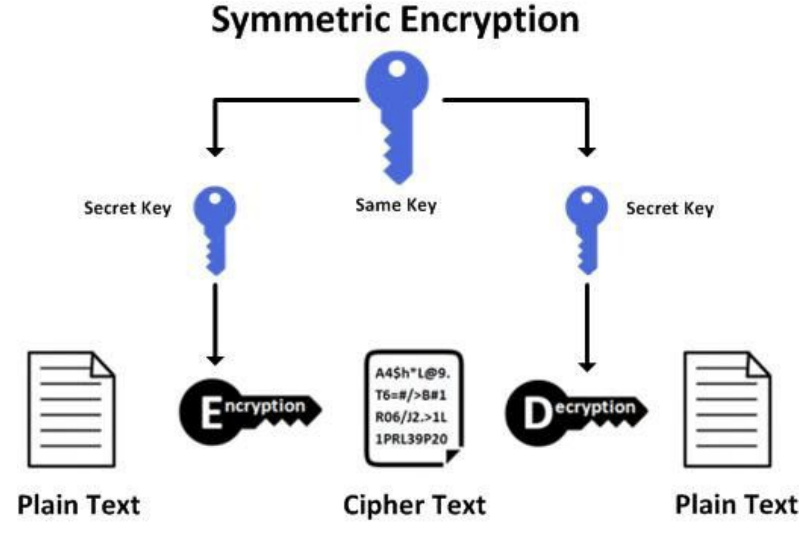
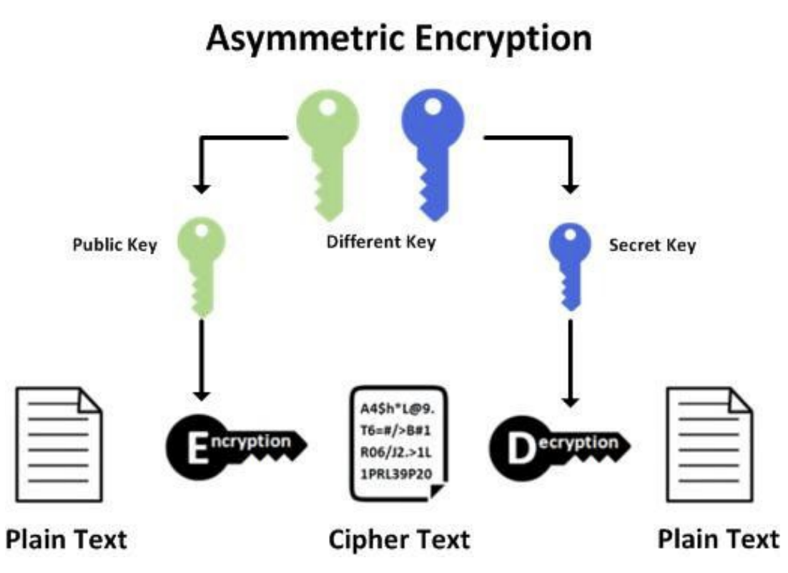
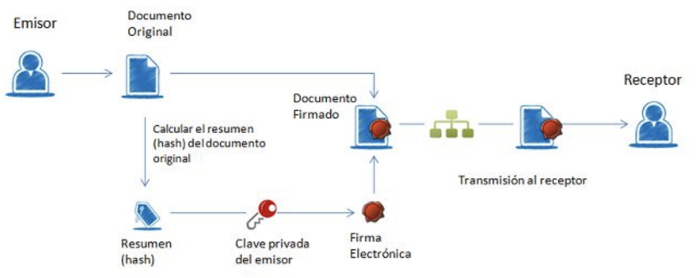
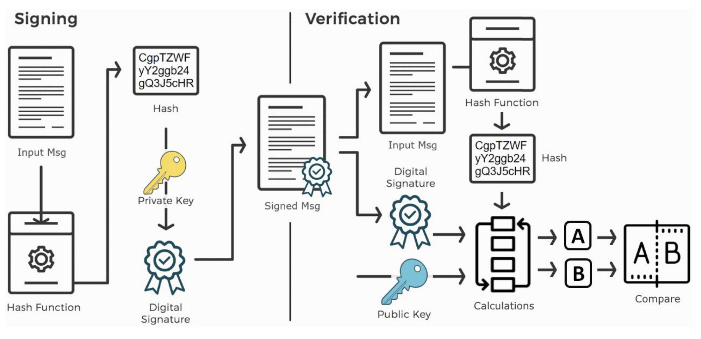

# Unidad 5 - Técnicas de programación seguras

## Seguridad digital

Los aspectos fundamentales de la seguridad en las comunicaciones digitales son los siguientes:

- **Integridad**: Permite asegurar que los datos que recibe un receptor son idénticos a los que ha enviado el emisor, es decir, no se ha modificado en
ningún punto intermedio en el canal, que como sabemos, es un canal compartido y por tanto, inseguro. Las modificaciones pueden ser causadas por fallos en la transmisión a través del canal o bien por una acción intencionada de un tercero.
- **Confidencialidad**: Nos asegura que los datos transmitidos son inteligibles sólo para el receptor del mensaje. Por las características del medio no podemos evitar que el mensaje llegue a otros destinatarios, pero lo que sí podemos evitar es que estos puedan ver el contenido original del mensaje. Esto se
consigue cifrando el mensaje.
- **Autenticación**: Permite asegurar al receptor de un mensaje que el emisor del mensaje es quien dice ser y no cualquier otro. Esto se consigue con los certificados y la firma digital.
- **No repudio**:  Es una consecuencia de la característica anterior, ya que un receptor puede demostrar que el mensaje fue enviado por un emisor de forma inequívoca.

## Seguridad en el entorno Java

Desde el punto de vista de la seguridad, el conjunto de clases de seguridad distribuidas con el SDK de Java SE pueden dividirse en dos subconjuntos:

- Clases relacionadas con el control de acceso y la gestión de permisos.
- Clases relacionadas con la criptografía.

Java incluye APIs de acceso a funciones criptográficas de propósito general, conocidas como la Arquitectura Criptográfica de Java o Java Cryptography
Architecture (JCA) y la Extension Criptográfica de Java o Java Cryptography Extension (JCE).

El JCA está formado por las clases básicas relacionadas con criptografía distribuidas con el JDK y el soporte para la encriptación lo proporciona el
paquete de extensión JCE. Java también incluye un conjunto de paquetes para la comunicación segura en Internet, conocidos como la Extensión de Sockets Seguros de Java o Java Secure Socket Extension (JSSE).

Por último Java incluye una interfaz que permite a las aplicaciones Java acceder a servicios de control de autenticación y acceso, el Servicio de
Autentificación y Autorización de Java o Java Authentication and Authorization Service (JAAS).

Java tiene una Arquitectura de Proveedores, que permite que coexistan multiples implementaciones de algoritmos criptográficos (es decir multiples
implementaciones del JCE). La plataforma Java 2 extiende substancialmente la JCA, entre otras cosas se ha mejorado la infraestructura de gestión de certificados para soportar los certificados X.509 V3.

Para comprender el funcionamiento del JCA tenemos que definir algunos términos básicos:

- **Engine**:  En el contexto del JCA utilizamos el término motor (engine) para referirnos a una representación abstracta de un servicio criptográfico que no tiene una implementación concreta. Un servicio criptográfico siempre está asociado con un algoritmo o tipo de algoritmo y puede tener alguna de las siguientes funciones:

    - Proporcionar operaciones criptográficas (como las empleadas en el firmado y el resumen de mensajes)- Generar o proporcionar el material criptográfico (claves o parámetros) necesario para realizar las operaciones.
    - Generar objetos (almacenes de claves o certificados) que agrupen claves criptográficas de modo seguro.

En el JDK el JCA se definen las siguientes clases Engine:

| Clase JCA | Función |
| -- | -- |
| java.security.MessageDigest | Calculo de resumen de mensajes (hash) |
| java.security.Signature | Firma de datos y verificación firmas |
| java.security.KeyPairGenerator | Generar pares de claves (pública y privada) para un algoritmo |
| java.security.KeyFactory | Convertir claves de formato criptográfico, especificaciones de claves y viceversa |
| java.security.certificate.CertificateFactory | Crear certificados de clave pública y listas de revocación(CRLs) |
| java.security.KeyStore | Crear y gestionar un almacén de claves (keystore) |
| java.security.AlgorithmParameters | Gestionar los parámetros de un algoritmo, incluyendo codificación y descodificación| 
| java.security.AlgorithmParameterGenerator | Generar un conjunto de parámetros para un algoritmo |
| java.security.SecureRandom | Generar números aleatorios o pseudo aleatorios |

- **Algoritmo**: Un algoritmo es una implementación de un motor. Por ejemplo, el algoritmo MD5 es una implementación del motor de algoritmos de resumen de mensajes. La implementación interna puede variar dependiendo del código que proporcione la clase MD5.
- **Proveedor**: Un proveedor es el encargado de proporcionar la implementación de uno o varios algoritmos al programador (es decir, darle acceso a una implementación interna concreta de los algoritmos). La JCA define el concepto de proveedor mediante la clase abstracta Provider del paquete java.security. El constructor de una clase proveedor ajusta los valores de varias propiedades que necesita el API de seguridad de Java para localizar los algoritmos u otras facilidades implementadas por el proveedor. La clase Provider tiene métodos para acceder al nombre del proveedor, el número de versión y otras informaciones sobre las implementaciones de los algoritmos para la generación, conversión y gestión de claves y la generación de firmas y resúmenes.
- **Funciones hash**: Un Message digest o resumen de mensaje, más conocidos como funciones hash, es una marca digital de un bloque de datos. Existe un gran número de algoritmos diseñados para procesar esto resúmenes, los dos más conocidos son SHA-1 y MD5. De un resumen cabe destacar las siguientes características:

    - Para el mismo algoritmo, el resumen siempre tiene el mismo tamaño, independientemente del tamaño de los datos que se haya usado para generarlo.
    - Es imposible recuperar la información original a partir de un resumen.
    - El resumen no debe desvelar nada sobre los datos que se utilizaron para generarlo.
    - Es computacionalmente inviable encontrar dos mensajes que tengan el mismo valor de resumen. Matemáticamente es altamente improbable, pero no imposible.
    - Un pequeño cambio en los datos resumidos genera un resumen completamente diferente.
    - Los resúmenes se usan para generar identificadores únicos y confiables.

- **MessageDigest**: La clase MessageDigest permite a las aplicaciones implementar algoritmos de resumen criptográficamente seguros como SHA- 256 o SHA-512 Para generar un hash con JCA se procede de la siguiente forma:

    1. Se crea un objeto de la clase MesageDigest con el método estático getInstance() de la misma clase, especificando el nombre del algoritmo. Opcionalmente, se puede especificar el nombre del proveedor.
    2. Se añaden datos con el método update(). Se puede añadir un byte o un array de bytes. Este método se puede invocar varias veces para ir añadiendo nuevos datos.
    3. Se obtiene el valor de hash con el método digest().
    4. Si se quisiera calcular un nuevo hash, se invocaría el método reset() para volver a empezar el proceso.

## Criptografía simétrica

Tenemos un conjunto de algoritmos denominados de clave simétrica (también conocidos como de clave secreta) en los que, mediante la aplicación de una clave conocida tanto por el emisor como por el receptor, la información se encripta o cifra de forma que sólo pueda ser desencriptada o descifrada utilizando el mismo algoritmo y la misma clave.

Entre los algoritmos de cifrado simétrico más utilizados se encuentran:

- DES
- 3DES o Tiple DES
- RC5
- AES
- Blowfish
- IDEA

<center>{ width="600" }</center>

### Cipher

Para cifrar y descifrar un mensaje necesitamos una clave y escoger el tipo de cifrado que queremos. En JCA se procede de la siguiente forma:

1. Se crea un objeto de la clase SecretKey a partir de un KeyGenerator obtenido con el método estático getInstance(), especificando el nombre del algoritmo. Opcionalmente, se puede especificar el nombre del proveedor.
2. Así podemos utilizar una clave prefijada o incluso una clave aleatoria de tipo OTP (One Time Password) ya que cada vez que ejecutemos el programa la clave será diferente.
3. Se crea un objeto de tipo Cipher indicando qué algoritmo vamos a usar. Y después, con el método init() se indica qué vamos a hacer (cifrar/descifrar) y
con qué clave.
4. Se añaden datos con el método update(). Se puede añadir un byte o un array de bytes. Este método se puede invocar varias veces para ir añadiendo nuevos
datos.
5. Se obtiene el valor cifrado con el método doFinal().
6. Si se quisiera descifrar, sólo hay que volver a invocar al método init() indicando en este caso que queremos descifrar.

#### Clases para cifrado y descifrado simétrico

Existen dos clases stream que permiten cifrar y descifrar directamente. Pertenecen al paquete java.crypto pero por lo demás funcionan exactamente
igual que las clases Stream del paquete java.io, de las que además son clases descendientes y tienen constructores que permiten crear streams encriptados sobre un InputStream y un OutputStream.

| Clase | Ejemplo |
| -- | -- |
| CipherInputStream | CipherInputStream (InputStream is, Cipher c) |
| CipherOutputStream | CipherOutputStream (OutputStream os, Cipher c) |

Por lo tanto, cuando tenemos que leer o escribir información, podemos añadir un envoltorio más al wrapper que utilizamos habitualmente y esto nos permite que tanto las lecturas como las escrituras se hagan cifradas, usando el algoritmo y la clave definidos para el objeto Cipher. El uso más común es para leer o escribir en archivos en los que, de igual forma, cambiando el wrapper nos permite leer o escribir la información de forma cifrada/descifrada.

### Ejemplo de criptografía simétrica

StreamCrypto.java

```java
package encriptacion_simetrica;

import java.io.BufferedInputStream;
import java.io.BufferedOutputStream;
import java.io.File;
import java.io.FileInputStream;
import java.io.FileOutputStream;
import java.io.IOException;
import java.io.InputStream;
import java.io.OutputStream;
import java.security.InvalidKeyException;
import java.security.NoSuchAlgorithmException;
import javax.crypto.Cipher;
import javax.crypto.CipherInputStream;
import javax.crypto.CipherOutputStream;
import javax.crypto.NoSuchPaddingException;
import javax.crypto.spec.SecretKeySpec;

public class StreamCrypto {

    public static void main(String[] args) throws NoSuchAlgorithmException, NoSuchPaddingException, InvalidKeyException, IOException {
        File file;
        String filePath = "a.txt";
        file = new File(filePath);
//Se define el objeto Cipher (Algoritmo/modo/relleno)
        Cipher c = Cipher.getInstance("AES/ECB/PKCS5Padding"); //DESede
// Configuramos el modo de CIFRADO
        byte[] valorClave = "12345678123456781234567812345678".getBytes();
// CIFRADO DEL STREAM (fichero a.txt)

        c.init(Cipher.ENCRYPT_MODE,
                new SecretKeySpec(valorClave, "AES"));
        try ( OutputStream outputStream = new BufferedOutputStream(
                new CipherOutputStream(new FileOutputStream(file), c))) {
            for (int i = 0; i < 10; i++) {
                outputStream.write(new String("Hello World\n").getBytes());
            }
        }
// DESCIFRADO DEL STREAM (fichero a.txt)

        c.init(Cipher.DECRYPT_MODE,
                new SecretKeySpec(valorClave, "AES"));
        try ( InputStream inputStream = new BufferedInputStream(
                new CipherInputStream(new FileInputStream(file), c))) {
            System.out.println("Contenido del fichero (descifrado):\n" + new String(inputStream.readAllBytes()));
        }
    }
}
```

SecretKeyEncrypt.java

```java
package encriptacion_simetrica;

import java.security.Key;
import java.security.NoSuchAlgorithmException;
import java.security.SecureRandom;
import java.security.spec.InvalidKeySpecException;
import javax.crypto.Cipher;
import javax.crypto.KeyGenerator;
import javax.crypto.SecretKey;
import javax.crypto.SecretKeyFactory;
import javax.crypto.spec.SecretKeySpec;

public class SecretKeyEncrypt {

    public static void main(String[] args) {
        SecretKey claveSecreta = null;
        try {
//Generamos clave secreta
// Podemos crear una nueva clave
            claveSecreta = getNewKey();
// O bien usar una clave guardada en algún almacén, fichero, etc.
            claveSecreta = getKeyFromData();
            System.out.println("Clave usada: " + claveSecreta.getFormat());
//Se define el objeto Cipher (Algoritmo/modo/relleno)
            Cipher c = Cipher.getInstance("DESede"); // AES/ECB/PKCS5Padding
// Configuramos el modo de CIFRADO
            c.init(Cipher.ENCRYPT_MODE, claveSecreta);
// Aquí leemos la información que queremos cifrar
// Puede ser una cadena o leerla de un archivo
            byte[] textoPlano = "Texto que queremos cifrar para la prueba".getBytes();
// Si queremos ir cifrando poco a poco, vamos haciendo llamadas
// al método update
// c.update(textoPlano);
// Se realiza el proceso final de cifrado de la información
            byte[] textoCifrado = c.doFinal(textoPlano);
            System.out.println("Texto cifrado con clave secreta (raw):\n" + new String(textoCifrado));
            System.out.println("Texto cifrado con clave secreta (hex):\n" + toHexadecimal(textoCifrado));
// El proceso de descifrado es equivalente
// Cambiamos el modo de ENCRYPT a DECRYPT
// Usamos la misma clave
// Pasamos el texto cifrado para obtener el original
            c.init(Cipher.DECRYPT_MODE, claveSecreta);
            byte[] textoOriginal = c.doFinal(textoCifrado);
//Leemos bloques de bytes del fichero y lo vamos escribiendo ya cifrado en el fichero de salida
            System.out.println("Texto descifrado:\n" + new String(textoOriginal));
        } catch (Exception e) {
            e.printStackTrace();
        }
    }

    static SecretKey getNewKey() throws InvalidKeySpecException, NoSuchAlgorithmException {
        KeyGenerator kg = KeyGenerator.getInstance("DESede");
        kg.init(112);
        SecretKey clave = kg.generateKey();
        return clave;
    }

    static SecretKey getNewRandomKey() throws InvalidKeySpecException, NoSuchAlgorithmException {
// Clave obtenida usando un generador de número aleatorios seguro
        KeyGenerator genClaves = KeyGenerator.getInstance("DESede");
// Utilizamos un algoritmo de generación de aleatorios
        SecureRandom srand = SecureRandom.getInstance("SHA1PRNG");
        genClaves.init(srand);
        SecretKey clave = genClaves.generateKey();
        System.out.println("Formato de clave: " + clave.getFormat());
        /*
SecretKeyFactory keySpecFactory = SecretKeyFactory.getInstance("DESede");
DESedeKeySpec keySpec = (DESedeKeySpec) keySpecFactory.getKeySpec(clave, DESedeKeySpec.class);
byte[] valorClave = keySpec.getKey();
         */
        return clave;
    }

    static SecretKey getKeyFromData() throws InvalidKeySpecException, NoSuchAlgorithmException {
// La clave se puede obtener desde un fichero o cualquier otra fuente
        byte valorClave[] = "12345678123456781234567812345678".getBytes();
        SecretKeySpec keySpec = new SecretKeySpec(valorClave, "DESede");
        SecretKeyFactory keyFactory = SecretKeyFactory.getInstance("DESede");
        SecretKey clave = keyFactory.generateSecret(keySpec);
        return clave;
    }

    static Key getKeyFromData2() throws InvalidKeySpecException, NoSuchAlgorithmException {
// La clave se puede obtener desde un fichero o cualquier otra fuente
        byte valorClave[] = "12345678123456781234567812345678".getBytes();
        Key clave = new SecretKeySpec(valorClave, "AES");
        return clave;
    }

    static String toHexadecimal(byte[] hash) {
        String hex = "";
        for (int i = 0; i < hash.length; i++) {
            String h = Integer.toHexString(hash[i] & 0xFF);
            if (h.length() == 1) {
                hex += "0";
            }
            hex += h;
        }
        return hex.toUpperCase();
    }
}
```

## Criptografía asimétrica

La criptografía asimétrica o criptografía de clave pública supuso una auténtica revolución en su momento. Permitía el intercambio seguro de información (confidencialidad, autenticación y no repudio) entre interlocutores que no compartían ningún secreto.

Se creó en los años 70 a partir del trabajo de Diffie y Hellman por una parte y de Rivest, Shamir y Adleman por otra. Se basa en la existencia de un par de claves, una pública y otra privada, entre las cuales existe una relación matemática, de manera que es muy difícil obtener la clave privada a partir de la pública. Sin embargo, es muy sencillo obtener la clave pública a partir de la privada. 

A diferencia del cifrado simétrico, en el cifrado asimétrico se usan funciones diferentes para cifrar y descifrar los mensajes.

- Para encriptación se usa la clave pública. Cualquiera puede tener acceso a la clave pública, mediante la cual, usando la función de cifrado, se encripta la información dirigida a un destinatario concreto (el propietario de la clave privada asociada).
- Para desencriptación se usa la clave privada, que debe mantenerse a buen recaudo ya que sólo con esa clave y la función de descifrado se puede desencriptar un mensaje cifrado con la clave pública correspondiente.

Entre los algoritmos de cifrado asimétrico más utilizados se encuentran:

- Rivest Shamir Adleman (RSA). Basado en la factorización de números primos grandes.
- Digital Signature Standard (DSS), que incorpora Digital Signature Algorithm (DSA).
- Elliptical Curve Cryptography (ECC). Está basado en las matemáticas de las curvas elípticas.
- The Diffie-Hellman exchange method.
- TLS/SSL protocol.

<center>{ width="600" }</center>

### Ejemplo de criptografía asimétrica

RsaKeyPairEncrypt.java

```java
package encriptacion_asimetrica;

import java.io.FileInputStream;
import java.io.FileNotFoundException;
import java.io.IOException;
import java.io.UnsupportedEncodingException;
import java.lang.System.Logger;
import java.lang.System.Logger.Level;
import java.security.InvalidKeyException;
import java.security.KeyFactory;
import java.security.NoSuchAlgorithmException;
import java.security.PrivateKey;
import java.security.PublicKey;
import java.security.spec.InvalidKeySpecException;
import java.security.spec.PKCS8EncodedKeySpec;
import java.security.spec.X509EncodedKeySpec;
import java.util.Base64;
import javax.crypto.BadPaddingException;
import javax.crypto.Cipher;
import javax.crypto.IllegalBlockSizeException;
import javax.crypto.NoSuchPaddingException;

public class RsaKeyPairEncrypt {

    private static final int tamanoClaveAsimetrica = 1024;
    private static final String algoritmoClaveAsimetrica = "RSA";
    private static final String ficheroClavePublica = "claves/clavepublica.der";
    private static final String ficheroClavePrivada = "claves/claveprivada.pkcs8";

    public static void main(String[] args) throws InvalidKeyException, IllegalBlockSizeException, InvalidKeySpecException {
        try {
//////////////////////////////////////////////////
// CIFRADO
//////////////////////////////////////////////////
// Leemos la clave pública de un archivo
            PublicKey clavePublica = leerClavePublica(ficheroClavePublica);
// Preparamos la información que queremos cifrar
            String textoEnClaro = "Quiero cifrar este mensaje de prueba";
            byte[] mensajeEnClaro = textoEnClaro.getBytes("UTF-8");
// Realizamos el proceso de cifrado con clave pública
// Los pasos son exactamente los mismos que con el cifrado simétrico
            Cipher cifrado = Cipher.getInstance(algoritmoClaveAsimetrica);
            cifrado.init(Cipher.ENCRYPT_MODE, clavePublica);
            byte[] mensajeCifrado = cifrado.doFinal(mensajeEnClaro);
// Visualizamos el mensaje cifrado en modo texto
            MostrarMensajeBase64(mensajeCifrado);
//////////////////////////////////////////////////
// DESCIFRADO
//////////////////////////////////////////////////
// Leemos la clave privada de un archivo
            PrivateKey clavePrivada = leerClavePrivada(ficheroClavePrivada);
// Realizamos el proceso de descifrado con clave privada
// Los pasos son exactamente los mismos que con el cifrado simétrico
// Cipher cifrado = Cipher.getInstance(algoritmoClaveAsimetrica);
            cifrado.init(Cipher.DECRYPT_MODE, clavePrivada);
            byte[] mensajeDescifrado = cifrado.doFinal(mensajeCifrado);
// Visualizamos el mensaje descifrado
            System.out.println("Texto descifrado:\n" + new String(mensajeDescifrado, "UTF-8"));
        } catch (UnsupportedEncodingException ex) {
            System.out.println("Codificación de caracteres UTF-8 no soportada");
        } catch (NoSuchAlgorithmException ex) {
            System.err.println("No se ha encontrado la implementación del algoritmo " + algoritmoClaveAsimetrica );
} catch (NoSuchPaddingException ex) {
            System.err.println("El relleno especificado para el algoritmo no está permitido");
        } catch (InvalidKeyException ex) {
            System.err.println("Especificación de clave no válida");
        } catch (IllegalBlockSizeException ex) {
            System.err.println("Tamaño de bloque no válido");
        } catch (BadPaddingException ex) {
            System.err.println("Excepción con el relleno usado por el algoritmo");
        }
    }

    private static PublicKey leerClavePublica(String ficheroClave) throws InvalidKeySpecException {
        byte[] clavePublicaEncoded;
// Leemos la información del archivo
        try ( FileInputStream publicKeyFile = new FileInputStream(ficheroClave)) {
            clavePublicaEncoded = publicKeyFile.readAllBytes();
        } catch (FileNotFoundException ex) {
            System.out.println("No se ha encontrado el archivo " + ficheroClave + " con la clave pública.");
            return null;
        } catch (IOException ex) {
            System.out.println("Se ha producido un error de E/S accediendo al archivo " + ficheroClave + " de la clave ");
return null;
        }
// Generamos la clave a partir del array de bytes leídos
        KeyFactory keyFactory;
        try {
            keyFactory = KeyFactory.getInstance(algoritmoClaveAsimetrica);
            X509EncodedKeySpec codificacionClavePublica = new X509EncodedKeySpec(clavePublicaEncoded);
            PublicKey clavePublica = keyFactory.generatePublic(codificacionClavePublica);
// Devolvemos la clave pública generada
            return clavePublica;
        } catch (NoSuchAlgorithmException ex) {
            System.err.println("No se ha encontrado la implementación del algoritmo " + algoritmoClaveAsimetrica );
return null;
        } catch (InvalidKeySpecException ex) {
      
            return null;
        }
    }

    private static PrivateKey leerClavePrivada(String ficheroClave) {
        byte[] clavePrivadaEncoded;
// Leemos la información del archivo
        try ( FileInputStream privateKeyFile = new FileInputStream(ficheroClave)) {
            clavePrivadaEncoded = privateKeyFile.readAllBytes();
        } catch (FileNotFoundException ex) {
            System.out.println("No se ha encontrado el archivo " + ficheroClave + " con la clave privada.");
            return null;
        } catch (IOException ex) {
            System.out.println("Se ha producido un error de E/S accediendo al archivo " + ficheroClave + " de la clave");
return null;
        }
// Generamos la clave a partir del array de bytes leídos
        KeyFactory keyFactory;
        try {
            keyFactory = KeyFactory.getInstance(algoritmoClaveAsimetrica);
            PKCS8EncodedKeySpec codificacionClavePrivada = new PKCS8EncodedKeySpec(clavePrivadaEncoded);
            PrivateKey clavePrivada = keyFactory.generatePrivate(codificacionClavePrivada);
// Devolvemos la clave pública generada
            return clavePrivada;
        } catch (NoSuchAlgorithmException ex) {
            System.err.println("No se ha encontrado la implementación del algoritmo " + algoritmoClaveAsimetrica);
return null;
        } catch (InvalidKeySpecException ex) {
          
            return null;
        }
    }

    private static void MostrarMensajeBase64(byte[] mensajeCifrado) {
        System.out.println("Mensaje cifrado visualizado como texto en Base64:");
        System.out.println(Base64.getEncoder().encodeToString(mensajeCifrado).replaceAll("(.{76})", "$1\n"));
    }
}
```

GenerateRsaKeyPair.java

```java
package encriptacion_asimetrica;

import java.io.FileOutputStream;
import java.io.IOException;
import java.security.KeyPair;
import java.security.KeyPairGenerator;
import java.security.NoSuchAlgorithmException;
import java.security.PrivateKey;
import java.security.PublicKey;
import java.security.SecureRandom;
import java.security.spec.PKCS8EncodedKeySpec;
import java.security.spec.X509EncodedKeySpec;
import java.util.Base64;

public class GenerateRsaKeyPair {

    private static final int tamanoClaveAsimetrica = 1024;
    private static final String algoritmoClaveAsimetrica = "RSA";
    private static final String ficheroClavePublica = "claves/clavepublica.der";
    private static final String ficheroClavePrivada = "claves/claveprivada.pkcs8";

    public static void main(String[] args) {
        try {
// Elijo un algoritmo de generación de números aleatorios de los denominados
// altamente seguros para generar el par de claves
            SecureRandom algoritmoSeguro = SecureRandom.getInstanceStrong();
// Preparo el generados de claves para usar el algortimo RSA
            KeyPairGenerator genParClaves = KeyPairGenerator.getInstance(algoritmoClaveAsimetrica);
            genParClaves.initialize(tamanoClaveAsimetrica, algoritmoSeguro);
// Creo el par de claves y lo guardo en objetos
            KeyPair parClaves = genParClaves.generateKeyPair();
            PublicKey clavePublica = parClaves.getPublic();
            PrivateKey clavePrivada = parClaves.getPrivate();
// Guardamos la clave pública en un archivo y la visualizamos
// La clave se guarda con codificación DER y en formato X.509
            guardaClavePublicaX509(clavePublica);
// Guardamos la clave privada en un archivo y la visualizamos
// La clave se guarda con codificación DER y en formato PKCS#8
            guardaClavePrivadaPKCS8(clavePrivada);
        } catch (NoSuchAlgorithmException ex) {
            System.err.println("No se ha encontrado la implementación del algortimo en ningún Provider");
        }
    }

    private static void guardaClavePublicaX509(PublicKey clavePublica) {
        try ( FileOutputStream publicKeyFile = new FileOutputStream(ficheroClavePublica)) {
            X509EncodedKeySpec codificacionClavePublica = new X509EncodedKeySpec(clavePublica.getEncoded(), algoritmoClaveAsimetrica);
            publicKeyFile.write(clavePublica.getEncoded());
// Visualizamos la clave por consola
            MostrarClaveBase64(codificacionClavePublica.getEncoded(),
                    codificacionClavePublica.getFormat(), ficheroClavePublica);
        } catch (IOException ex) {
            System.out.println("Error almacenando la clave pública en " + ficheroClavePublica);
        }
    }

    private static void guardaClavePrivadaPKCS8(PrivateKey clavePrivada) {
        try ( FileOutputStream privateKeyFile = new FileOutputStream(ficheroClavePrivada)) {
            PKCS8EncodedKeySpec codificacionClavePrivada = new PKCS8EncodedKeySpec(clavePrivada.getEncoded(), algoritmoClaveAsimetrica);
            privateKeyFile.write(clavePrivada.getEncoded());
// Visualizamos la clave por consola
            MostrarClaveBase64(codificacionClavePrivada.getEncoded(),
                    codificacionClavePrivada.getFormat(), ficheroClavePrivada);
        } catch (IOException ex) {
            System.out.println("Error almacenando la clave privada en " + ficheroClavePrivada);
        }
    }

    private static void MostrarClaveBase64(byte[] clave, String formatoClave, String ficheroClave) {
        System.out.println("Clave guardada en formato " + formatoClave
                + " en fichero " + ficheroClave);
        System.out.println(Base64.getEncoder().encodeToString(clave).replaceAll("(.{76})", "$1\n"));
    }
}
```

## Firma digital

Con la firma digital para cifrar y descifrar un mensaje necesitamos una clave y escoger el tipo de cifrado que queremos. En JCA se procede de la siguiente forma:

<center>{ width="600" }</center>

El proceso básico que se sigue para la firma electrónica es el siguiente:

1. El usuario dispone de un documento electrónico (una hoja de cálculo, un pdf, una imagen, incluso un formulario en una página web) y de un certificado (clave pública y clave privada) que le pertenece y le identifica.
2. La aplicación o dispositivo digital utilizados para la firma realiza un resumen del documento. El resumen de un documento de gran tamaño puede llegar a ser tan solo de unas líneas. Este resumen es único y cualquier modificación del documento implica también una modificación del resumen.
3. La aplicación utiliza la clave privada para codificar el resumen.
4. La aplicación crea otro documento electrónico que contiene ese resumen codificado. Este nuevo documento es la firma electrónica. El resultado de todo este proceso es un documento electrónico obtenido a partir del documento original y de las claves del firmante. La firma electrónica, por tanto, es el mismo documento electrónico resultante.

<center>{ width="600" }</center>

- **Integridad**: Como estamos comparando funciones de resumen de un documento, se puede detectar de forma muy sencilla si el documento ha sufrido alguna
modificación respecto al momento en el que se firmó, garantizando de esta forma la integridad de la información firmada.
- **Autenticación y no repudio**: Por las características de los algoritmos de cifrado se puede determinar, a partir del resumen cifrado con la clave privada, mediante el uso de la clave pública, que el mensaje recibido lo generó el propietario de la clave privada. Con esta característica se puede probar y demostrar que el mensaje lo firmó el emisor y no cualquier otra persona, garantizando por un lado la autoría y por otro evitando que el emisor niegue haber generado esa información.

## Certificados digitales

Un certificado digital es un documento electrónico expedido por una Autoridad de Certificación e identifica a una persona (física o jurídica)
con un par de claves.Tiene como misión validar y certificar que una firma electrónica se corresponde con una persona o entidad concreta.

Contiene la información necesaria para firmar electrónicamente e identificar a su propietario con sus datos: nombre, NIF, algoritmo y claves de firma, fecha de expiración y organismo que lo expide.

La Autoridad de Certificación da fe de que la firma electrónica se corresponde con un usuario concreto. Esa es la razón por la que los certificados están firmados, a su vez, por la Autoridad de Certificación.

### Claves digitales

En un certificado, las claves digitales son los elementos esenciales para la firma e identificación del firmante. Existen dos claves, la clave privada y
clave pública, y trabajan de forma complementaria. Lo que cifra o codifica una clave sólo lo puede descifrar o decodificar la otra.

La diferencia entre ellas es que la clave privada está pensada para que nunca salga del certificado y esté siempre bajo el control del firmante. En cambio, la clave pública se puede repartir o enviar a otros usuarios.

En ocasiones, se habla de Certificado Privado para referirse al certificado que contiene la clave privada y la pública y del Certificado Público para referirse al certificado que sólo contiene la clave pública.

### Infraestructura de clave pública (PKI)

Una infraestructura de clave pública (PKI) es una combinación de hardware, software, procedimientos de seguridad y marco legal que, en su conjunto,
permite la ejecución con garantías de operaciones criptográficas, cumpliendo los requisitos de integridad, confidencialidad, autenticación y no repudio.

Una PKI permite establecer y gestionar asociaciones entre claves públicas e identidades de personas y organizaciones. La cuestión entonces es determinar si un certificado es válido o de confianza, o lo que es lo mismo, si representa a la persona u organización que aparece como titular y propietario del certificado. Para dar por válido un certificado digital su firma digital debe ser válida y su emisor debe ser un emisor de confianza. Por lo tanto, ahora queda determinar qué emisores son de confianza.

### Autoridades de certificación

Los certificados deben estar firmados por una AC por dos motivos:

1. Garantizar su integridad, de forma que cualquier intento de modificación del certificado lo invalide.
2. Identificar al creador del certificado digital. Todo el sistema está basado en una relación de confianza, en la que la AC que ha firmado el certificado es un emisor de confianza, normalmente instituciones públicas o privadas de reconocido prestigio.

En nuestro sistema podemos ver y modificar qué entidades de certificación consideramos como seguras, es decir, que los certificados que éstas hayan
firmado los tomaremos como válidos. En Windows, si ejecutamos certmgr.msc podemos acceder a la configuración de certificados del sistema. En OSX lo podemos hacer con la aplicación Llavero.

Para nuestra navegación, la información de qué certificados considera el navegador como seguros, depende de en qué AC confiemos (por defecto en la instalación vienen configurados los más comunes).

## Generación de par de claves

La generación y gestión de pares de claves implica dos aspectos fundamentales. Por un lado, tenemos la creación de las claves. Las claves las podemos haber descargado, generado con alguna de las utilidades disponibles para ellos o bien, como veremos a continuación, se pueden generar desde una aplicación, igual que hacemos con las claves simétricas. 

Por otro lado, tenemos la gestión del almacenamiento de las claves. Las claves no dejan de ser archivos, que podemos tratar como archivos especiales, pero que usualmente se almacenan en repositorios especiales, denominados keyrings a los que puede acceder una aplicación y desde los que gestionamos las relaciones de confianza.

El JCA nos proporciona clases generadoras de claves. Estas clases se apoyan en buenos algoritmos de generación de números aleatorios para satisfacer unos requisitos mínimos de seguridad. La clase SecureRandom genera número aleatorios empleando alguno de los algoritmos disponibles y se puede utilizar un objeto de tipo SecureRandom para que los utilicen las clases generadoras de claves, tanto simétricas como asimétricas.

Hay varios tipos de ficheros que se utilizan para guardar certificados digitales siguiendo el estándar X.509. Generalmente un certificado no contiene sólo la clave, sino que tiene información adicional.

Existen dos posibles codificaciones para almacenar certificados X.509:

- **der**: Es una codificación binaria.
- **dem**: Es una codificación en formato texto guardado en Base64 y tienen un encabezado y pie que delimita el contenido del certificado. 

Además de la codificación, tenemos formatos de fichero estándar para guardar los certificados usando una de las codificaciones anteriores:

- **cer, crt, der**: Contienen certificados X.509 estándares codificados como der.
- **p12**: Realmente hace referencia a toda una familia de estándares asociados al algoritmo RSA y definen el formato de almacenamiento de distintos tipos de claves, los PKCS#n (PKCS#8, PKCS#12, etc). Pueden contener, además de los datos del certificado, una clave privada. Si contiene la clave privada, ésta estará protegida por una contraseña que será necesaria para acceder a la clave privada.

Usando las clases del JCA, estos son los pasos que debemos seguir para generar un par de claves desde código:

1. El primer paso para obtener un par de claves es obtener un objeto keyPairGenerator para el algoritmo que queramos utilizar.
2. A continuación se inicializa el generador del par de claves llamando a alguna de las versiones del método initialize. En nuestro caso indicaremos el tamaño de clave para el algoritmo seleccionado y un generador de números aleatorios.
3. El último paso es generar el par de claves y guardarlas en los objetos PrivateKey y PublicKey respectivamente.
4. A partir de ese momento ya se pueden usar las claves para cifrar, descifrar e incluso para firmar. Sin embargo, si queremos reutilizar estas claves, lo que tendremos que hacer será guardarlas en sendos archivos.

## Comunicaciones seguras con Java

### Protocolo SSL y JSSE 

SSL es el protocolo habitualmente usado para encriptar la comunicación cliente-servidor. Casi todo el tráfico de la red puede encriptarse con
SSL: POP, IMAP, telnet, FTP, etc, pero es especialmente interesante para dotar de seguridad al protocolo HTTP, es decir como base del HTTPS.

La implementación de SSL es una extensión de los sockets que permite establecer un canal (stream) de comunicación. Dicha comunicación se inicia con un handshake durante el cual, el cliente y el servidor construyen una session-key (clave simétrica encriptada con par de claves asimétricas) compartida para verificar su identidad mutua.

JSSE (Java Secure Socket Extension) es un conjunto de paquetes que permiten el desarrollo de aplicaciones seguras en Internet. Proporciona un marco y una implementación para Java de los protocolos SSL y TSL e incluye funcionalidad de:

- Encriptación de datos.
- Autenticación de servidores.
- Integridad de mensajes.
- Autenticación de clientes.

Con JSSE, los programadores pueden ofrecer intercambio seguro de datos entre un cliente y un servidor que ejecuta un protocolo de aplicación, tales como HTTP, Telnet o FTP, a través de TCP/IP. Las clases de JSSE se encuentran en los paquetes javax.net y javax.net.ssl.

Las clases SSLSocket y SSLServerSocket representan sockets seguros y son derivadas de las ya conocidas Socket y ServerSocket respectivamente.
JSSE tiene dos clases SSLServerSocketFactory y SSLSocketFactory para la creación de sockets seguros. No tienen constructor, se obtienen a través del método estático getDefault(). 

Para obtener un socket servidor seguro o SSLServerSocket:

```java
SSLServerSocketFactory sfact = (SSLServerSocketFactory) SSLServerSocketFactory.getDefault();
SSLServerSocket servidorSSL = (SSLServerSocket) sfact.createServerSocket(puerto);
```

El método createServerSocket(int puerto) devuelve un socket de servidor enlazado al puerto especificado. Para crear un SSLSocket:

```java
SSLSocketFactory sfact = (SSLSocketFactory) SSLSocketFactory.getDefault();
SSLSocket Cliente = (SSLSocket) sfact.createSocket(Host, puerto);
```

El método createSocket(String host, int puerto) crea un socket y lo conecta con el host y el puerto especificados.

#### Keytool: certificados, confianza y almacenes de claves

Cuando dos sockets SSL, uno cliente y otro servidor, intentan establecer conexión, tienen que "presentarse" el uno al otro y comprobar que el otro es de confianza. Si todo va bien y uno confía en el otro, la conexión se establece, en caso contrario, no se establece.

Para establecer esa confianza se debe crear un certificado en el servidor y añadirlo a los certificados de confianza del cliente:

- El servidor debe tener su propio certificado. Si no lo tenemos, se puede generar primero una pareja de claves con la herramienta keytool, que viene incluida en el JDK de Java. La herramienta guardará la pareja de claves en un almacén (el cual tiene su propia clave).
- Después generaremos un certificado a partir de esa pareja.
- El código del servidor necesitará indicar el fichero donde se almacenan las claves y la clave para acceder a ese almacén.
- El cliente necesitará indicar que confía en el certificado del servidor. Dicho certificado del servidor puede estar guardado (por ejemplo) en el almacén de claves del cliente.

#### Servidor y cliente SSL

La inicialización del ServerSocket es diferente a como cuando lo hacíamos en la unidad 3 con las conexiones cliente-servidor. A partir de que se llama al método accept y, en este caso se obtiene una instancia de tipo SSLSocket, el resto del código es igual que con la clase Socket.

```java
SSLSocket clienteConectado = null;
SSLServerSocketFactory sfact = (SSLServerSocketFactory) SSLServerSocketFactory.getDefault();
SSLServerSocket servidorSSL = (SSLServerSocket) sfact.createServerSocket(puerto);
clienteConectado = (SSLSocket) servidorSSL.accept();
```

En el cliente el proceso es el mismo, tras la llamada al método createSocket, obtenemos una instancia de SSLSocket que utilizamos igual que si fuese un Socket.

```java
SSLSocket clienteSSL = null;
System.setProperty("javax.net.ssl.trustStore", "CertificadosConfianzaCliente");
System.setProperty("javax.net.ssl.trustStorePassword", "87654321");
SSLSocketFactory sfact = (SSLSocketFactory) SSLSocketFactory.getDefault();
clienteSSL = (SSLSocket) sfact.createSocket(host, puerto);
```

Si ejecutamos el cliente y el servidor directamente, obtendremos el siguiente error:

```java
Programa Cliente iniciado....
Exception in thread "main" javax.net.ssl.SSLHandshakeException: Received fatal alert: handshake_failure
```

Para ejecutar el programa servidor es necesario indicar el certificado que se utilizará. Lo podemos indicar a la hora de ejecutar el programa, añadiendo a la línea de comandos.

```java
java -Djavax.net.ssl.keyStore=ClavesServidor -Djavax.net.ssl.keyStorePassword=12345678
```

y en el programa cliente es necesario indicar la ubicación de los certificados de confianza:

```java
java -Djavax.net.ssl.trustStore=CertificadosConfianzaCliente -Djavax.net.ssl.trustStorePassword=87654321
```

o bien, en las opciones de ejecución del IDE

FALTA IMAGEN DE CONFIGURACION DE INTELLIJ -> Run -> Edit configuration -> Modify option -> add VM option

Una vez hechos los cambios, bien en las opciones de la JVM o bien en el código de las aplicaciones, la salida que obtendremos será esta:

```java
Esperando al cliente 1
Recibiendo del CLIENTE: 1
Saludos al SERVIDOR DESDE EL CLIENTE
Esperando al cliente 2
Recibiendo del CLIENTE: 2
Saludos al SERVIDOR DESDE EL CLIENTE
Esperando al cliente 3
Programa Cliente iniciado....
Recibiendo del SERVIDOR:
Saludos al cliente del servidor
```

##### Ejemplo cliente/servidor con SSL

SSLClient.java

```java
package cliente_servidor_SSL;

import java.io.DataInputStream;
import java.io.DataOutputStream;
import java.io.IOException;
import java.math.BigInteger;
import java.security.cert.CertificateParsingException;
import java.security.cert.X509Certificate;
import javax.net.ssl.SSLPeerUnverifiedException;
import javax.net.ssl.SSLSession;
import javax.net.ssl.SSLSocket;
import javax.net.ssl.SSLSocketFactory;

public class SSLClient {

    public static void main(String[] arg) throws IOException {
        SSLSocket clienteSSL = null;
        DataInputStream flujoEntrada = null; //FLUJO DE ENTRADA DE CLIENTE
        DataOutputStream flujoSalida = null; //FLUJO DE SALIDA AL CLIENTE
// Las propiedades se pueden especificar mediante código, o bien mediante
// argumentos de la JVM en la llamada a la aplicación
// System.setProperty("javax.net.ssl.trustStore", System.getProperty("user.dir") + "/CertificadosConfianzaClien
        System.setProperty("javax.net.ssl.trustStore", "CertificadosConfianzaCliente");
        System.setProperty("javax.net.ssl.trustStorePassword", "87654321");
// Inicialización del ServerSocket SSL
        int puerto = 6000;
        String host = "localhost";
        System.out.println("Programa Cliente iniciado....");
        SSLSocketFactory sfact = (SSLSocketFactory) SSLSocketFactory.getDefault();
        clienteSSL = (SSLSocket) sfact.createSocket(host, puerto);
// Trabajamos do DataInputStream y DataOutputStream para simplificar
// el código del ejemplo
        flujoSalida = new DataOutputStream(clienteSSL.getOutputStream());
        flujoEntrada = new DataInputStream(clienteSSL.getInputStream());
// Envío un saludo al servidor
        flujoSalida.writeUTF("Saludos al SERVIDOR DESDE EL CLIENTE");
// El Servidor responde con un mensaje
        System.out.println("Recibiendo del SERVIDOR: \n\t" + flujoEntrada.readUTF());
// CERRAR STREAMS Y SOCKETS
        flujoEntrada.close();
        flujoSalida.close();
        clienteSSL.close();
    }

    void mostrarInformacionSesionSSL(SSLSocket cliente) throws SSLPeerUnverifiedException, CertificateParsingException {
//------------------------------------------------------------------------------
//Ejemplo de la múltiple información sobre la sesión SSL
// que se puede obtener a partir
        SSLSession session = ((SSLSocket) cliente).getSession();
        System.out.println("Host: " + session.getPeerHost());
        System.out.println("Cifrado: " + session.getCipherSuite());
        System.out.println("Protocolo: " + session.getProtocol());
        System.out.println("IDentificador:" + new BigInteger(session.getId()));
        System.out.println("Creación de la sesión: " + session.getCreationTime());
        X509Certificate certificate = (X509Certificate) session.getPeerCertificates()[0];
        System.out.println("Propietario: " + certificate.getSubjectAlternativeNames());
        System.out.println("Algoritmo: " + certificate.getSigAlgName());
        System.out.println("Tipo: " + certificate.getType());
        System.out.println("Emisor: " + certificate.getIssuerAlternativeNames());
        System.out.println("Número Serie: " + certificate.getSerialNumber());
//-----------------------------------------------------------------------------
    }

}
```

SSLServer.java

```java
package cliente_servidor_SSL;

import java.io.DataInputStream;
import java.io.DataOutputStream;
import java.io.IOException;
import javax.net.ssl.SSLServerSocket;
import javax.net.ssl.SSLServerSocketFactory;
import javax.net.ssl.SSLSocket;

public class SSLServer {

    public static void main(String[] arg) throws IOException {
        SSLSocket clienteConectado = null;
        DataInputStream flujoEntrada = null; //FLUJO DE ENTRADA DE CLIENTE
        DataOutputStream flujoSalida = null; //FLUJO DE SALIDA AL CLIENTE

// Las propiedades se pueden especificar mediante código, o bien mediante
// argumentos de la JVM en la llamada a la aplicación
// System.setProperty("javax.net.ssl.keyStore", System.getProperty("user.dir") + "\\ClavesServidor");
// System.setProperty("javax.net.ssl.keyStorePassword", "12345678");
// Inicialización del ServerSocket SSL
        int puerto = 6000;
        SSLServerSocketFactory sfact = (SSLServerSocketFactory) SSLServerSocketFactory.getDefault();
        SSLServerSocket servidorSSL = (SSLServerSocket) sfact.createServerSocket(puerto);
        for (int i = 1; i < 5; i++) {
            System.out.println("Esperando al cliente " + i);
// Se espera la conexión de un cliente con accept
            clienteConectado = (SSLSocket) servidorSSL.accept();
// Trabajamos do DataInputStream y DataOutputStream para simplificar
// el código del ejemplo
            flujoEntrada = new DataInputStream(clienteConectado.getInputStream());
            flujoSalida = new DataOutputStream(clienteConectado.getOutputStream());
// El cliente envía un mensaje
            System.out.println("Recibiendo del CLIENTE: " + i + " \n\t" + flujoEntrada.readUTF());
// El Servidor responde con un saludo
            flujoSalida.writeUTF("Saludos al cliente del servidor");
        }
// CERRAR STREAMS Y SOCKETS
        flujoEntrada.close();
        flujoSalida.close();
        clienteConectado.close();
        servidorSSL.close();
    }

}
```